## Part 1. Установка ОС

- проверка версии убунту

```bash
cat /etc/issue
```
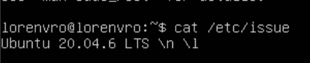

## Part 2. Создание пользователя
- создание пользователя и добавление в группу adm
```bash
sudo useradd -m -G adm task2user
```
-m добашний каталог
-G adm добавление в группу amd
```bash
cat /etc/passwd
```
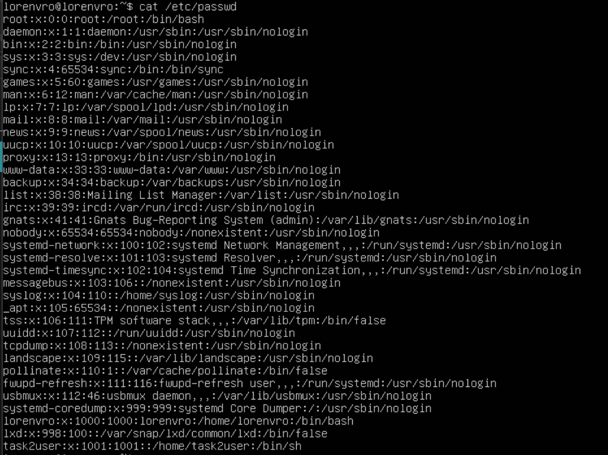

## Part 3. Настройка сети ОС
- установка имени машины
```bash
sudo hostnamectl set-hostname user-1
```
- установка временной зоны
```bash
sudo timedatectl set-timezone Europe/Moscow
```
- вывод сетевых интерфейсов
```bash
ip link show
```
Интерфейс lo - loopback интерфейс для общения сервера с собой. Для тестирования трафика внутри системы. ip - 127.0.0.1. Необходим для работы многих сетевых приложений и сервисов.

- получения IP адреса, выданного DHCP ( Dynamic Host Configuration Protocol) - протокол выдачи динамических ип адрессов/параметров
```bash
ip a
```

- вывод ип адреса по умолчанию
```bash
ip route
```
- внешний ип адрес
```bash
curl ifconfig.me
```


- содержимое /etc/netplan
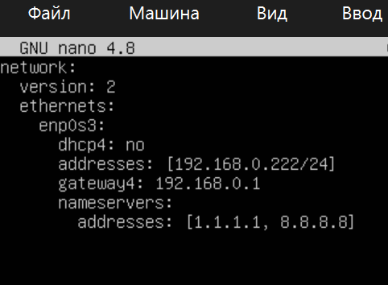
Применение настроек:
```bash
sudo netplan apply
sudo netplan try
```

поменял режим сетевого адаптера virtualbox
изменил конфигурацию netplan
пропинговал 1.1.1.1 и ya.ru, что показано на скриншоте
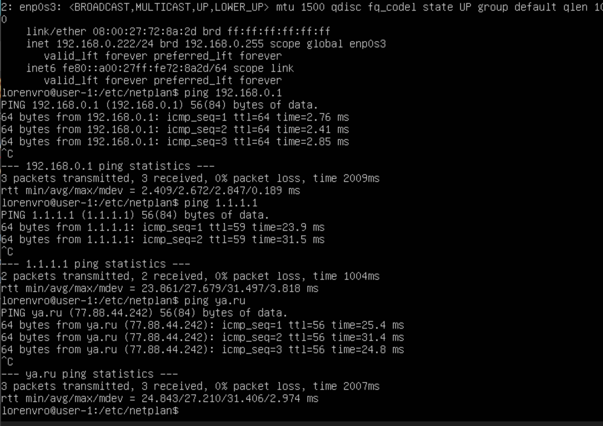

## Part 4. Обновление ОС
- обновление пакетов
```bash
sudo apt update
sudo apt upgrade -y
```

- проверка обновлений:
  ```bash
  sudo apt upgrade
  apt list --upgradable
  ```
- вывод sudo apt update:

  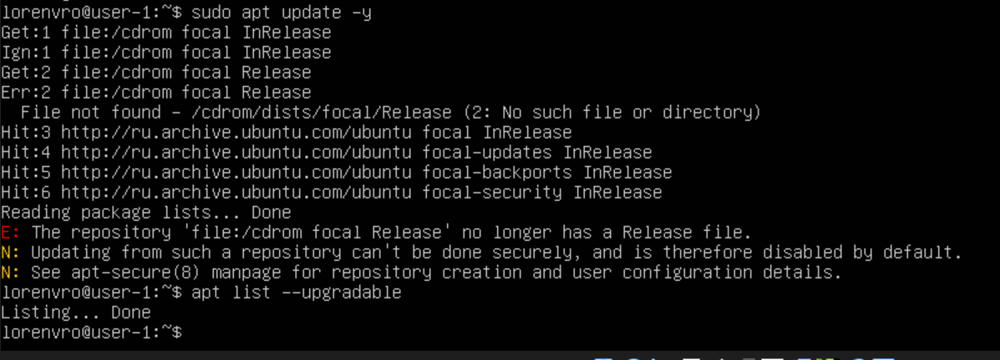

## Part 5. Использование команды sudo

sudo (substitute user and do) - выполнение команды с правами суперпользователя (root).

- добавление созданного в part 2 пользователя в группу sudo:
  ```bash
  sudo usermod -aG sudo task2user
  sudo visudo
  #по аналогии с root
  ```
- изменение hostname от task2user

```bash
su - task2user
sudo hostnamectl set-hostname task2user
hostnamectl
```
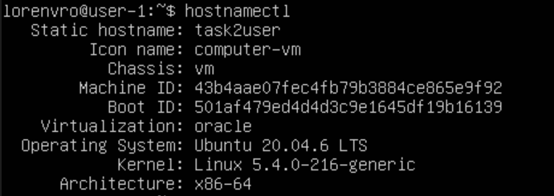

## Part 6. Установка и настройка службы времени
- По умолчанию службы синхронизации времени были настроены
```bash
sudo apt install systemd-timesyncd
sudo systemctl enable systemd-timesyncd
sudo systemctl start systemd-timesyncd
```
- Вывод времени и вывод времени со строчкой NTPSynchronized=yes:
```bash
timedatectl
timedatectl show
```
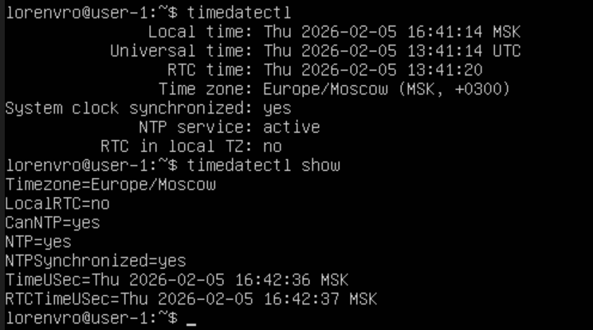

## Part 7. Установка и использование текстовых редакторов
- установка текстовых редакторов
```bash
sudo apt install vim nano joe -y
```
### Редактирование с сохранением
- vim
```
- i для перехода в режим ввода текста
- esq для выхода из режима ввода текста
- :wq для выхода с сохранением
```
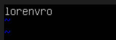
- nano
```
- ctrl+o для сохранения
- ctrl-x для выхода
```
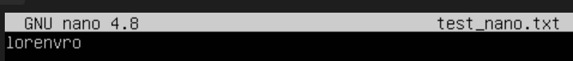

- joe
```
- ctrl+k зачем x
```
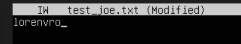
### Редактирование без сохранения
- vim
```
- i для перехода в режим ввода текста
- esq для выхода из режима ввода текста
- :q! для выхода без сохранения
```
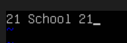
- nano
```
- ctrl-x для выхода
- n для выхода без сохранения
```
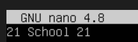

- joe
```
- ctrl+c и y для подтверждения выхода без сохранения
```
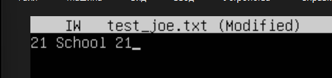

### Поиск и замена
- поиск vim
```
- нажать "/" и вести слово для поиска -> enter
```
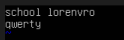
- замена vim
```
- :%s/school/zxc/g 
```
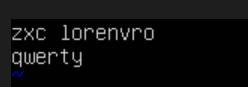

- поиск nano
```
- ctrl+w и слово для поиска
```
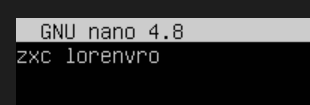

- замена nano
```
- ctrl+\ и слово для поиска, после слово для замены и подтверждение
```
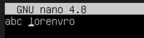

- поиск joe
```
- ctrl+k f и слово для поиска
```
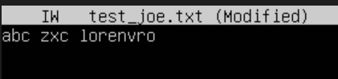

- замена joe
```
- ctrl+k F  и слово для поиска затем R, после слово для замены и подтверждение
```
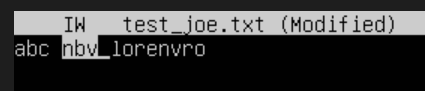
## Part 8. Установка и базовая настройка сервиса SSHD
- установка SSH
```bash
sudo apt install openssh-server -y
```
- добавление автостарта
```bash
sudo systemctl enable ssh
```
- перенастройка на порт 2022
```bash
sudo vim /etc/ssh/sshd_config
## раскоментировать строку Port 22 и заменить на 2022
sudo systemctl restart ssh
```
- наличие процессора команда ps
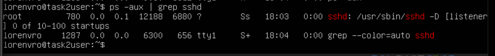
- вывод команды netstat -tan
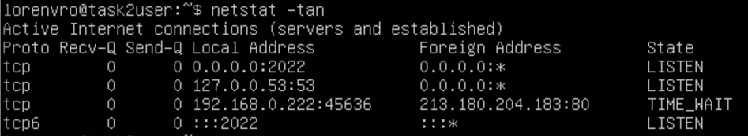

**Объяснение команды:**
- `ps` - команда для вывода списка процессов
- `-a` - показать процессы всех пользователей
- `-u` - отображать пользователя-владельца процесса и другую подробную информацию
- `-x` - показать процессы, не привязанные к терминалу
- `| grep sshd` - фильтрация вывода для отображения только строк, содержащих "sshd"

**Объяснение ключей -tan:**
- `-t` - показать только TCP соединения
- `-a` - показать все соединения и прослушиваемые порты
- `-n` - показывать числовые адреса вместо разрешения имён хостов

**Объяснение столбцов вывода:**
- `Proto` - протокол (tcp)
- `Recv-Q` - количество байт в очереди приёма
- `Send-Q` - количество байт в очереди отправки
- `Local Address` - локальный адрес и порт
- `Foreign Address` - удалённый адрес и порт
- `State` - состояние соединения
- `0.0.0.0:` - прослушиваются все доступные сетевые интерфейсы

## Part 9. Установка и использование утилит top, htop
- установка htop, top
```bash
sudo apt install htop -y
sudo apt install top -y
```
** вывод top **
- uptime - 12min
- количество авторизованных пользователей: 1
- среднюю загрузку системы:  0.00, 0.08, 0.11
- общее количество процессов: 122
- загрузку cpu: 0.0
- загрузку памяти: 3919.5 total, 3915.1 free, 186.6 used
- pid процесса занимающего больше всего памяти: 1742 (shift+m)
- pid процесса, занимающего больше всего процессорного времени: 10 (shift+p)

** вывод htop **
- отсортированному по PID; F6 PID
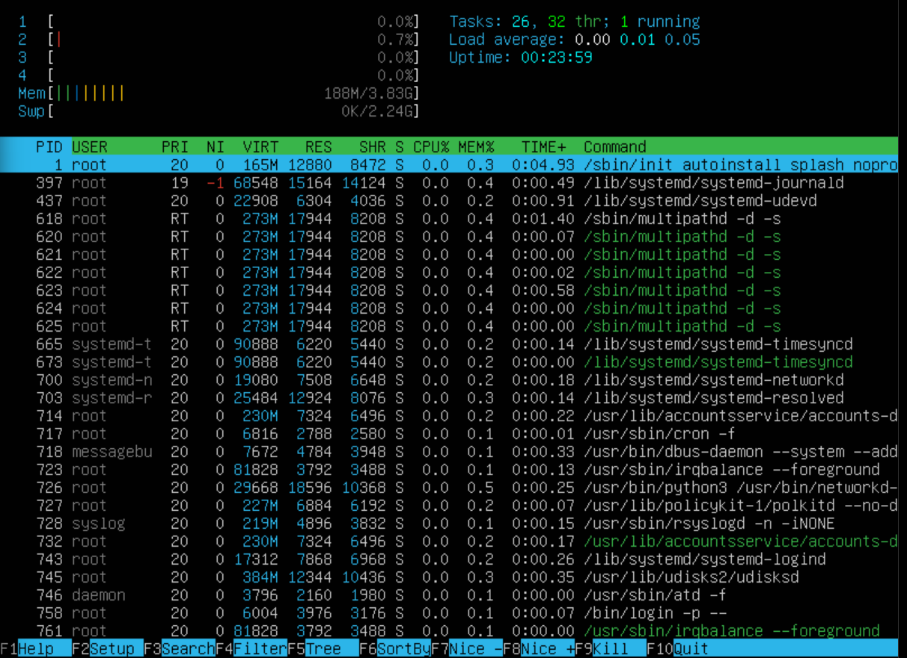
- отсортированному по PERCENT_CPU; F6 PERCENT_CPU
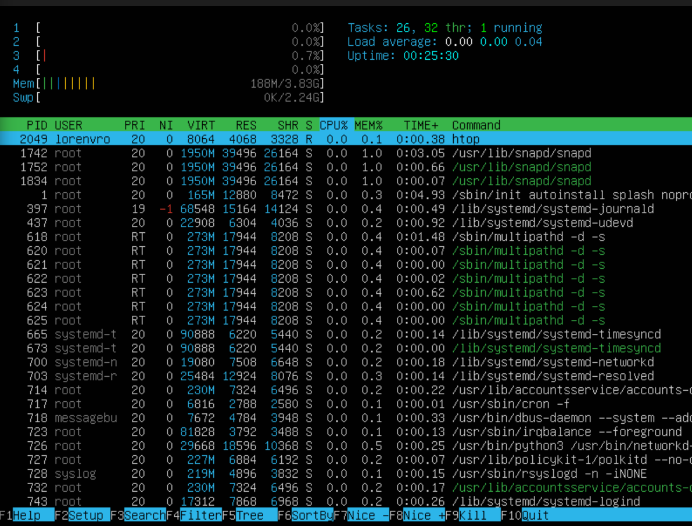
- отсортированному по PERCENT_MEM; F6 PERCENT_MEM
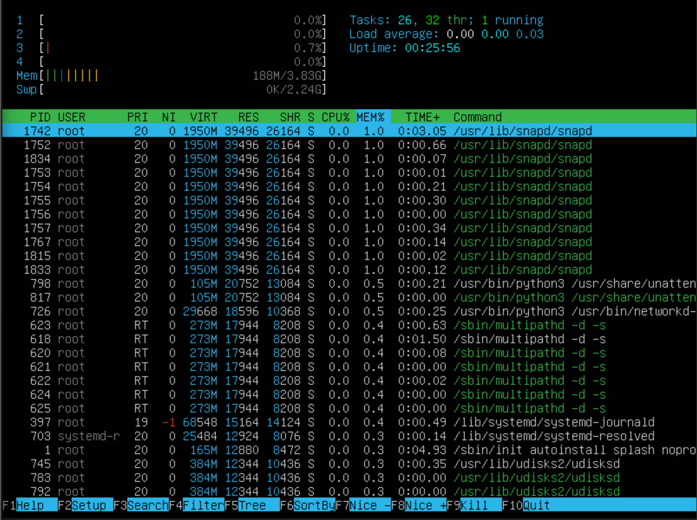
- отсортированному по TIME; F6 TIME
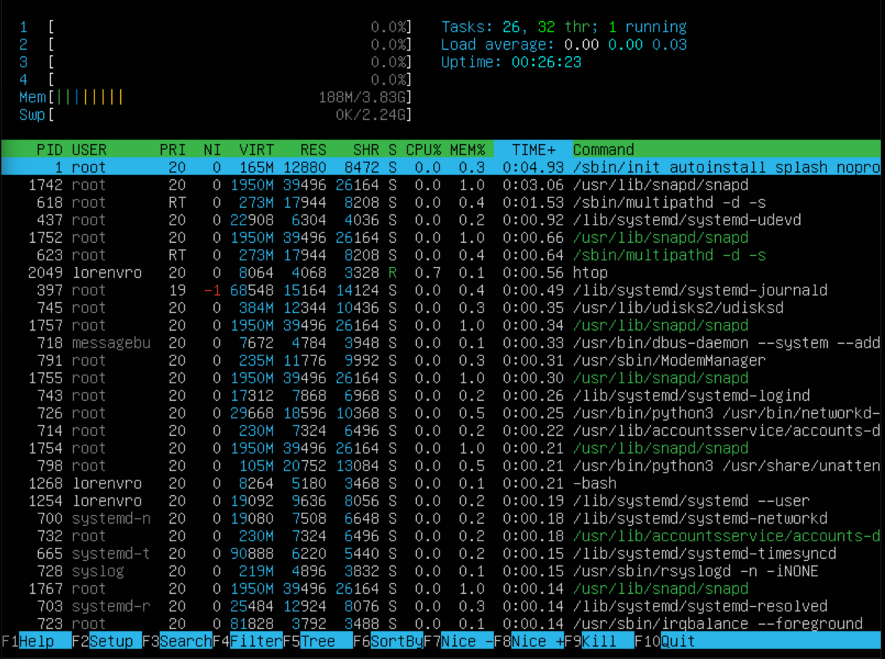
- отфильтрованному для процесса sshd; F4 sshd 
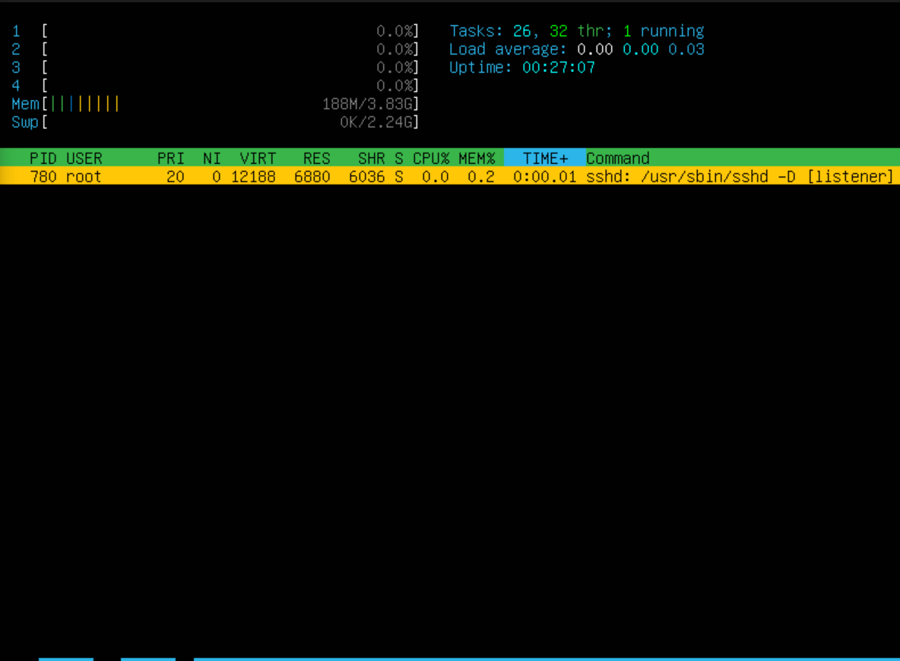
- с процессом syslog, найденным, используя поиск; F3 syslog
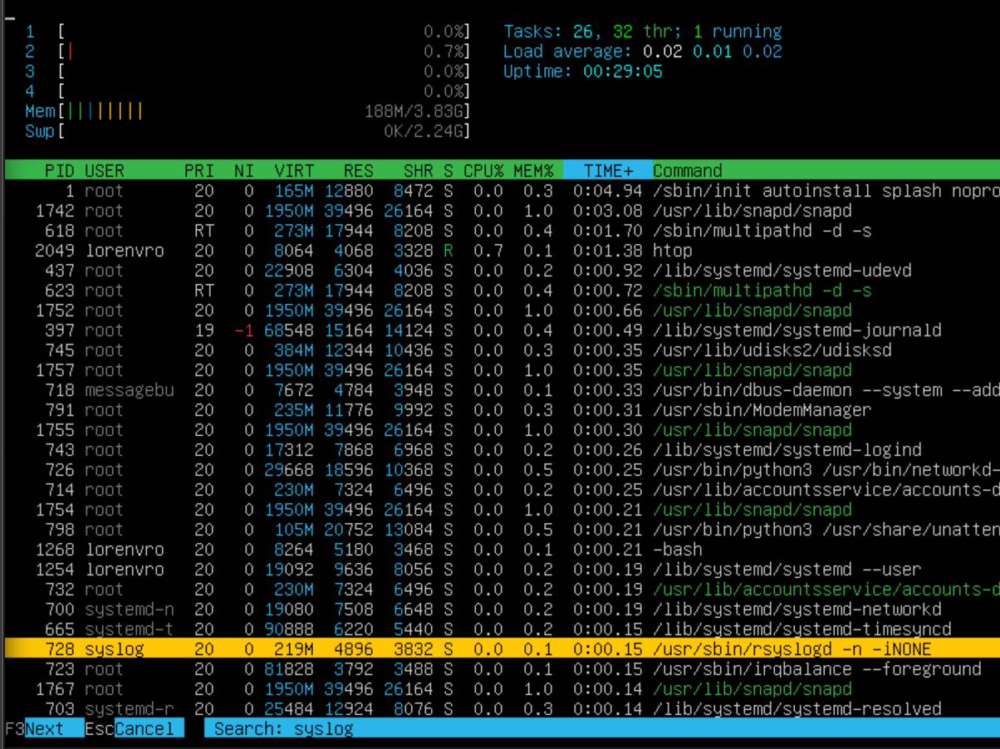
- с добавленным выводом hostname, clock и uptime. F2 и выбор hostname, clock и uptime.
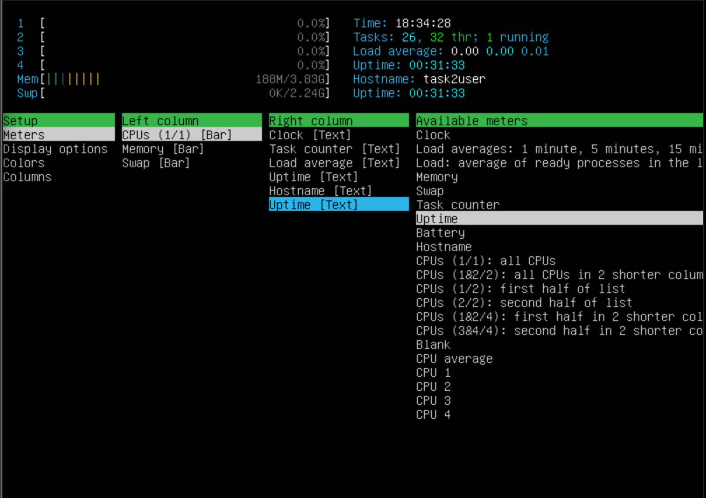

## Part 10. Использование утилиты fdisk
**Информация о жёстком диске:**
- **Название жёсткого диска:** /dev/sda
- **Размер:** 25 GiB (26843545600 bytes)
- **Количество секторов:** 52428800 sectors
- **Размер swap:** 2.2 Gi

## Part 11. Использование утилиты df
```bash
df
```

**Информация о корневом разделе (/):**
- **Размер раздела:** 11758760
- **Занятое пространство:** 5321192 
- **Свободное пространство:** 5818460
- **Процент использования:** 48%
- **Единица измерения:** килобайты
```bash
df -Th
```

**Информация о корневом разделе (/):**
- **Размер раздела:** 12G
- **Занятое пространство:** 5.1G 
- **Свободное пространство:** 5.6G
- **Процент использования:** 48%
- **Единица измерения:** гигабайты

## Part 12. Использование утилиты du
- размер папок в человекочитаемом виде:
```bash
sudo du -sh /home /var/log /var
```
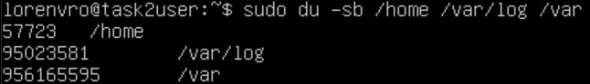

- размер всего содержимого в /var/log:
```bash
sudo du -sh /var/log/*
```
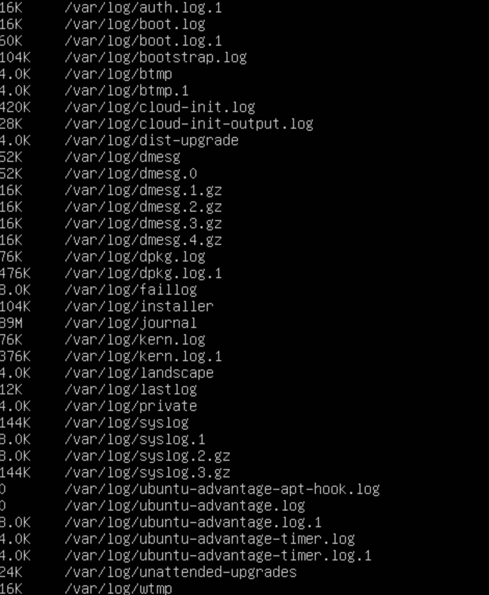

## Part 13. Установка и использование утилиты ncdu

- установка утилиты:
```bash
sudo apt install ncdu -y
```

- Вывод размера папок:
```bash
ncdu /home
ncdu /var
ncdu /var/log
```
- home
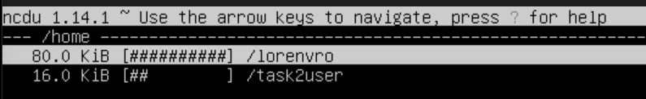
- var
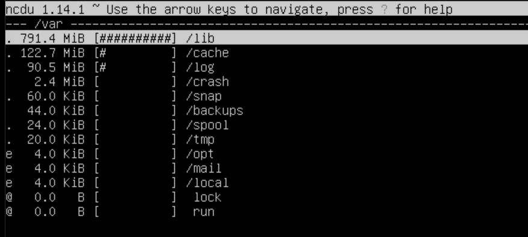
- var/log
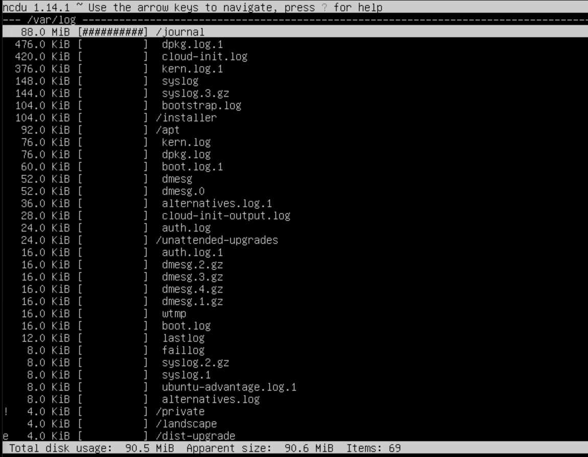

## Part 14. Работа с системными журналами

- последний успешный вход
время: Feb 5 18:04:07
имя пользователя: lorenvro
метод: sshd
- Перезапуск службы SSHd:
```bash
sudo systemctl restart ssh
```
- скрин с сообщением о рестарте
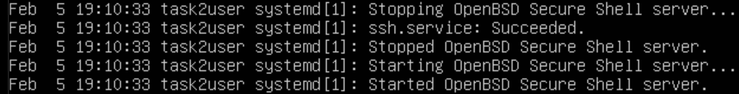
## Part 15. Использование планировщика заданий CRON
- Запуск команды uptime через каждые 2 минуты 
```bash
crontab -e
## добавить строчку */2 * * * * uptime
```

- вывод аптайма в логах
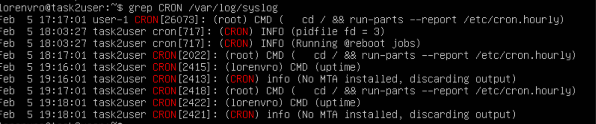

- вывод списка текущих заданий для CRON
```bash
crontab -l
```
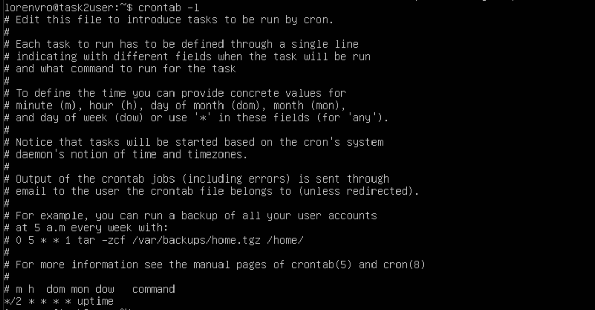

- удаление всех заданий из планировщика заданий
```bash
crontab -r
```
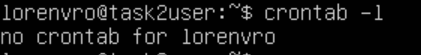
