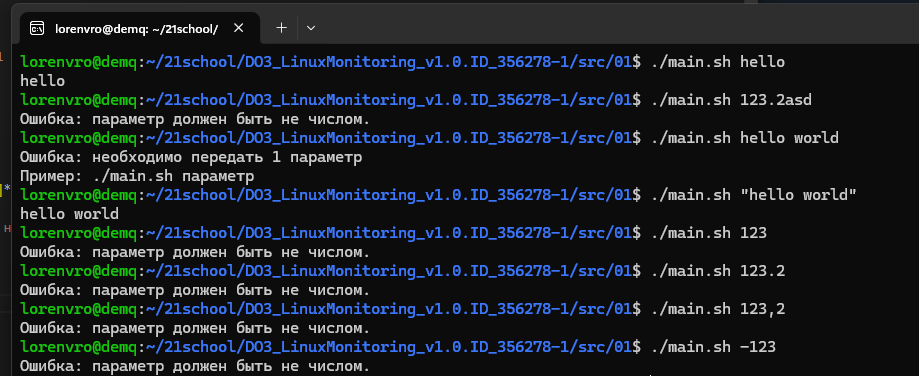

## Задание 01 - Проба пера
### Задание
Напиши bash-скрипт. Скрипт запускается с одним параметром. Параметр текстовый. Скрипт выводит значение параметра. Если параметр — число, то должно выводиться сообщение о некорректности ввода.
### Использование
```
chmod +x main.sh
./main.sh abc
```
Пример вывода:


