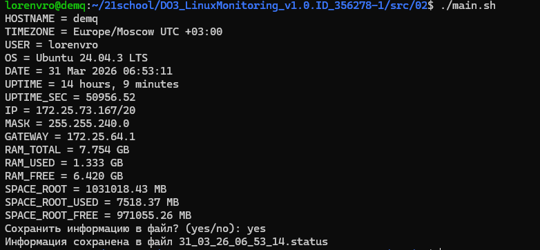

## Задание 02 - Исследование системы
### Задание
Напиши bash-скрипт. Скрипт должен вывести на экран информацию в виде:\
HOSTNAME = сетевое имя\
TIMEZONE = временная зона в виде: America/New_York UTC -5 (временная зона, должна браться из системы и быть корректной для текущего местоположения)\
USER = текущий пользователь, который запустил скрипт\
OS = тип и версия операционной системы\
DATE = текущее время в виде: 12 May 2020 12:24:36\
UPTIME = время работы системы\
UPTIME_SEC = время работы системы в секундах\
IP = ip-адрес машины в любом из сетевых интерфейсов\
MASK = сетевая маска любого из сетевых интерфейсов в виде: xxx.xxx.xxx.xxx\
GATEWAY = ip шлюза по умолчанию\
RAM_TOTAL = размер оперативной памяти в Гб c точностью три знака после запятой в виде: 3.125 GB\
RAM_USED = размер используемой памяти в Гб c точностью три знака после запятой\
RAM_FREE = размер свободной памяти в Гб c точностью три знака после запятой\
SPACE_ROOT = размер рутового раздела в Mб с точностью два знака после запятой в виде: 254.25 MB\
SPACE_ROOT_USED = размер занятого пространства рутового раздела в Mб с точностью два знака после запятой\
SPACE_ROOT_FREE = размер свободного пространства рутового раздела в Mб с точностью два знака после запятой\

После вывода значений предложи записать данные в файл (предложить пользователю ответить Y/N).\
Ответы Y и y считаются положительными, все прочие — отрицательными. При согласии пользователя в текущей директории пусть создается файл, содержащий информацию, которая была выведена на экран.\
Название файла должно иметь вид: DD_MM_YY_HH_MM_SS.status (Время в имени файла должно указывать момент сохранения данных).\
### Использование
```
chmod +x main.sh
./main.sh
```
Пример вывода:


