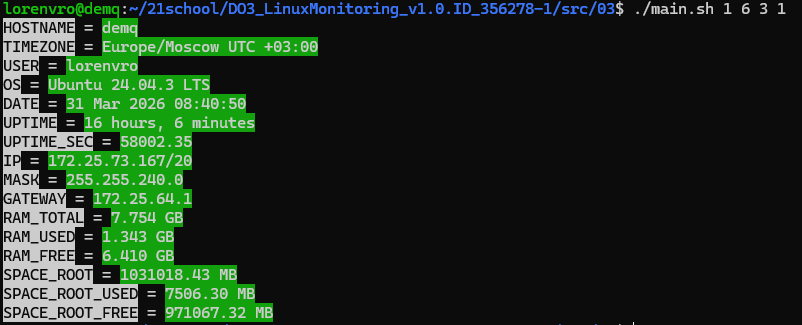

## Задание 03 - Визуальное оформление вывода для скрипта исследования системы
### Задание
Напиши bash-скрипт. За основу возьми скрипт из задания 3 и убери из него часть, ответственную за сохранение данных в файл. Скрипт запускается с 4 параметрами. Параметры числовые. От 1 до 6, например:\
script03.sh 1 3 4 5\

Обозначения цветов: (1 — white, 2 — red, 3 — green, 4 — blue, 5 – purple, 6 — black)\
Параметр 1 — это фон названий значений (HOSTNAME, TIMEZONE, USER и т. д.).\
Параметр 2 — это цвет шрифта названий значений (HOSTNAME, TIMEZONE, USER и т. д.).\
Параметр 3 — это фон значений (после знака '=').\
Параметр 4 — это цвет шрифта значений (после знака '=').\

Цвета шрифта и фона одного столбца не должны совпадать.\
При вводе совпадающих значений должно выводиться сообщение, описывающее проблему, и предложение повторно вызвать скрипт.\
После вывода сообщения программа должна корректно завершиться.\
### Использование
```
chmod +x main.sh 1 2 3 4
./main.sh
```
Пример вывода:


