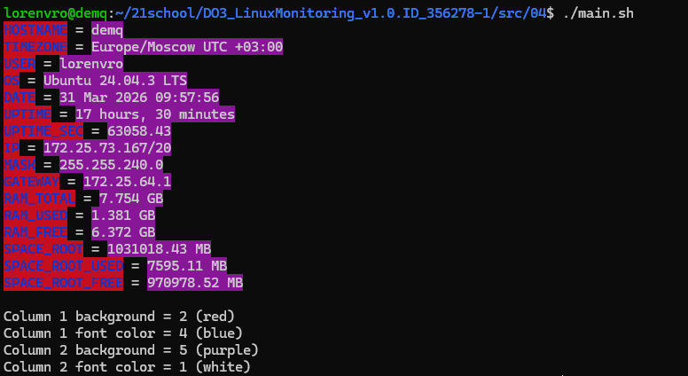

## Задание 04 - Конфигурирование визуального оформления вывода для скрипта исследования системы
### Задание
Напиши bash-скрипт. За основу возьми скрипт из Part 3. Обозначения цветов аналогичные.\
Скрипт запускается без параметров. Параметры задаются в конфигурационном файле до запуска скрипта.\
Конфигурационный файл должен иметь вид:
```
column1_background=2
column1_font_color=4
column2_background=5
column2_font_color=1
```
Если один или несколько параметров не заданы в конфигурационном файле, то цвет должен подставляться из цветовой схемы, заданной по умолчанию. (Выбор на усмотрение разработчика).\

После вывода информации о системе из Part 3, нужно, сделав отступ в одну пустую строку, вывести цветовую схему в следующем виде:
```
Column 1 background = 2 (red)
Column 1 font color = 4 (blue)
Column 2 background = 5 (purple)
Column 2 font color = 1 (white)
```
При запуске скрипта с цветовой схемой по умолчанию вывод должен иметь вид:
```
Column 1 background = default (black)
Column 1 font color = default (white)
Column 2 background = default (red)
Column 2 font color = default (blue)
```
### Использование
```
chmod +x main.sh
./main.sh
```
Пример вывода:


