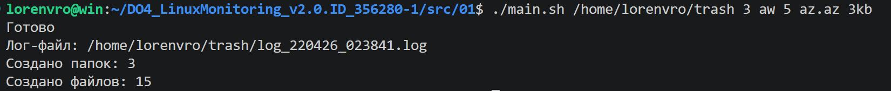
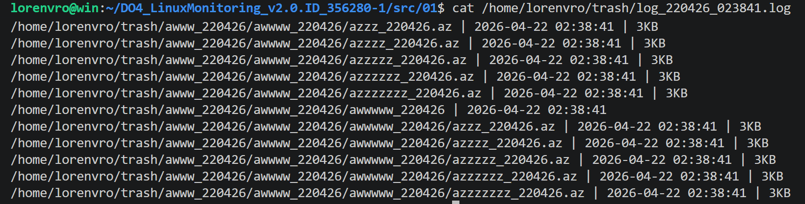

# Задание 01 - Генератор файлов

## Задание
Напиши bash-скрипт. Скрипт запускается с 6 параметрами. Пример запуска скрипта:
main.sh /opt/test 4 az 5 az.az 3kb\
Параметр 1 — это абсолютный путь.\
Параметр 2 — количество вложенных папок.\
Параметр 3 — список букв английского алфавита, используемый в названии папок (не более 7 знаков).\
Параметр 4 — количество файлов в каждой созданной папке.\
Параметр 5 — список букв английского алфавита, используемый в имени файла и расширении (не более 7 знаков для имени, не более 3 знаков для расширения).\
Параметр 6 — размер файлов (в килобайтах, но не более 100).

Имена папок и файлов должны состоять только из букв, указанных в параметрах, и использовать каждую из них хотя бы один раз.
Длина этой части имени должна быть от четырех знаков, плюс дата запуска скрипта в формате DDMMYY, отделённая нижним подчёркиванием, например:
```./aaaz_021121/, ./aaazzzz_021121```

При этом если для имени папок или файлов были заданы символы az, то в названии файлов или папок не может быть обратной записи:
./zaaa_021121/, т. е. порядок указанных символов в параметре должен сохраняться.

При запуске скрипта в месте, указанном в Параметре 1, должны быть созданы папки и файлы в них с соответствующими именами и размером.\
Скрипт должен остановить работу, если в файловой системе (в разделе /) останется 1 Гб свободного места.
Запиши лог-файл с данными по всем созданным папкам и файлам (полный путь, дата создания, размер для файлов).

## Использование
```bash
cd 01
chmod +x main.sh
./main.sh /home/lorenvro/trash 3 aw 5 az.az 3kb
```



## Содержимое лог файла

