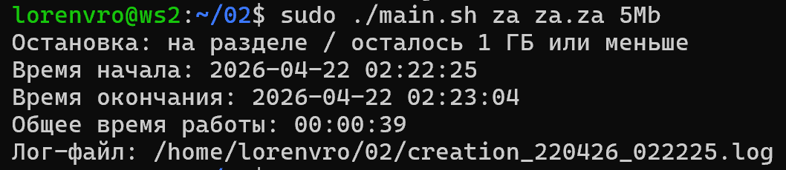
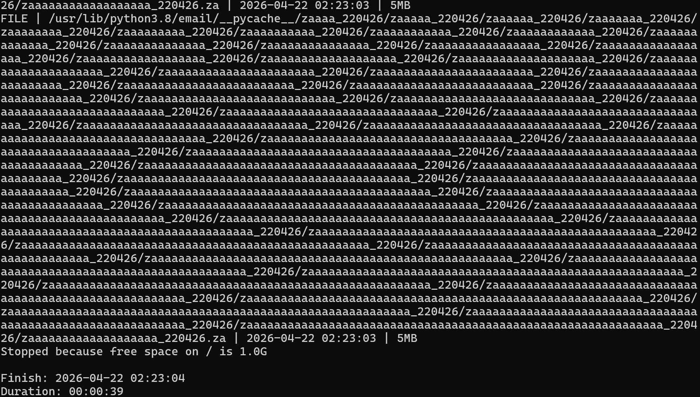

# Задание 02 - Засорение файловой системы

## Задание
Напиши bash-скрипт. Скрипт запускается с 3 параметрами. Пример запуска скрипта:
```main.sh az az.az 3Mb```\
Параметр 1 — список букв английского алфавита, используемый в названии папок (не более 7 знаков).\
Параметр 2 — список букв английского алфавита, используемый в имени файла и расширении (не более 7 знаков для имени, не более 3 знаков для расширения)\
Параметр 3 — размер файла (в Мегабайтах, но не более 100).

Имена папок и файлов должны состоять только из букв, указанных в параметрах, и использовать каждую из них хотя бы 1 раз.\
Длина этой части имени должна быть от 5 знаков, плюс дата запуска скрипта в формате DDMMYY, отделённая нижним подчёркиванием, например:
./aaazz_021121/, ./aaazzzz_021121

При этом если для имени папок или файлов были заданы символы az, то в названии файлов или папок не может быть обратной записи:
./zaaa_021121/, т. е. порядок указанных в параметре символов должен сохраняться.

При запуске скрипта в различных (любых, кроме путей, содержащих bin или sbin) местах файловой системы должны быть созданы папки с файлами. Количество вложенных папок — до 100. Количество файлов в каждой папке — случайное число (для каждой папки своё).
Скрипт должен остановить работу, когда в файловой системе (в разделе /) останется 1 Гб свободного места.
Свободное место в файловой системе определять командой: df -h /

Запиши лог-файл с данными по всем созданным папкам и файлам (полный путь, дата создания, размер для файлов).
В конце работы скрипта выведи на экран время начала работы скрипта, время окончания и общее время его работы. Дополни этими данными лог-файл.

## Использование
```bash
cd 02
chmod +x main.sh
./main.sh az az.az 5Mb
```



## Содержимое лог файла

