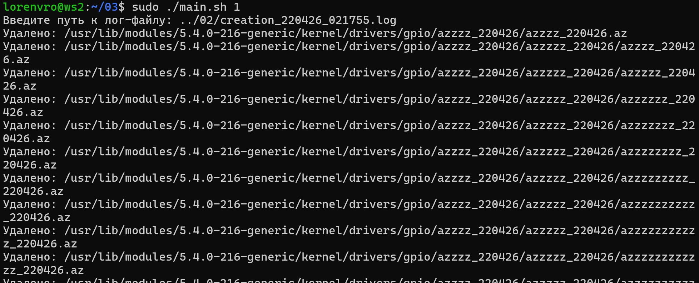
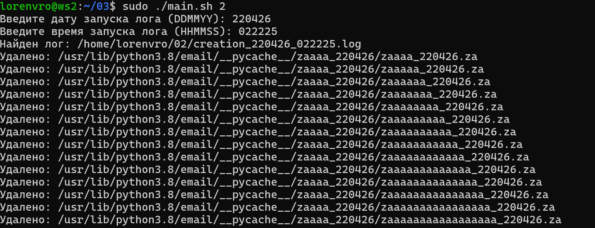
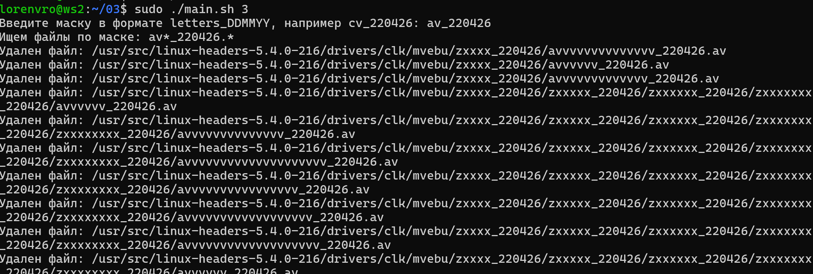

# Задание 3 - Очистка файловой системы
## Задание
Напиши bash-скрипт. Скрипт запускается с 1 параметром. Скрипт должен уметь очистить систему от созданных в Part 2 папок и файлов 3 способами:

- По лог файлу
- По дате и времени создания
- По маске имени (т. е. символы, нижнее подчёркивание и дата).

Способ очистки задается при запуске скрипта, как параметр со значением 1, 2 или 3.

При удалении по дате и времени создания пользователем вводятся времена начала и конца с точностью до минуты. Удаляются все файлы, созданные в указанном временном промежутке. Ввод может быть реализован как через параметры, так и во время выполнения программы.


## Использование

```
cd 03
chmod +x main.sh
./main.sh 1
./main.sh 2
./main.sh 3
```

Удаление по логу:



Удаление по времени лога:



Удаление по маске:

