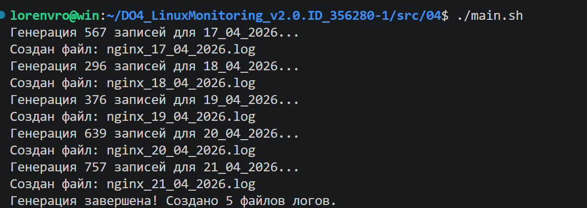
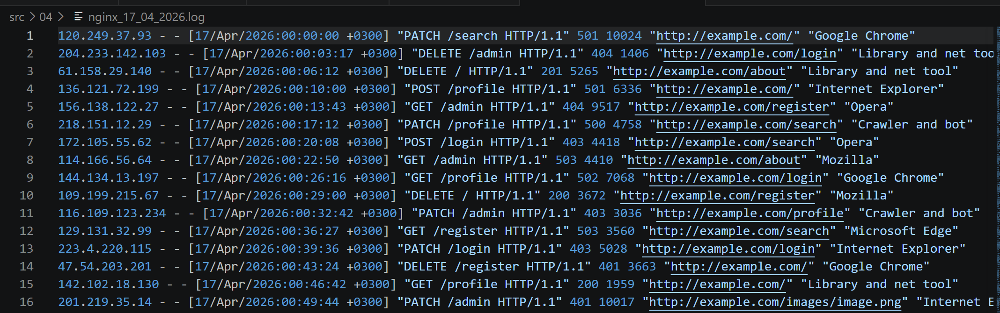

# Задание 04 - Генератор логов

## Задание

Напиши bash-скрипт или программу на С, генерирующие 5 файлов логов nginx в combined формате. Каждый лог должен содержать информацию за один день.

За день должно быть сгенерировано случайное число записей от 100 до 1000. Для каждой записи должны случайным образом генерироваться:

- IP (любые корректные, т. е. не должно быть ip вида 999.111.777.777)
- Коды ответа (200, 201, 400, 401, 403, 404, 500, 501, 502, 503)
- Методы (GET, POST, PUT, PATCH, DELETE)
- Даты (в рамках заданного дня лога, должны идти по увеличению)
- URL запроса агента
- Агенты (Mozilla, Google Chrome, Opera, Safari, Internet Explorer, Microsoft Edge, Crawler and bot, Library and net tool)

В комментариях к своему скрипту/программе укажи, что означает каждый из использованных кодов ответа.


## Использование

Пример использования программы:



Содержимое лог файлов:



```
# HTTP коды ответа:
# 200 OK - Успешный запрос
# 201 Created - Ресурс создан
# 400 Bad Request - Некорректный запрос
# 401 Unauthorized - Требуется аутентификация
# 403 Forbidden - Доступ запрещён
# 404 Not Found - Ресурс не найден
# 500 Internal Server Error - Ошибка сервера
# 501 Not Implemented - Не реализовано
# 502 Bad Gateway - Ошибка шлюза
# 503 Service Unavailable - Сервис недоступен
```