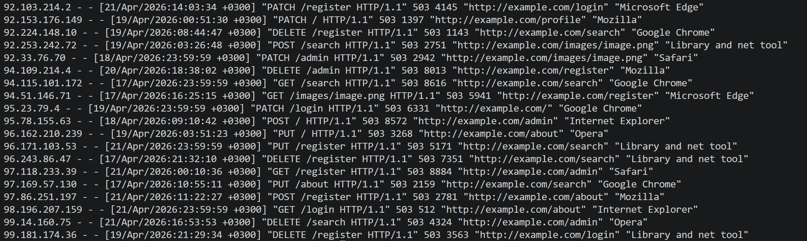
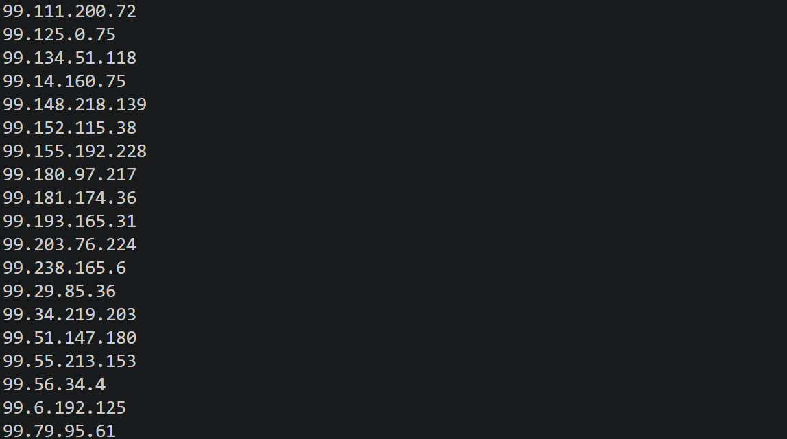
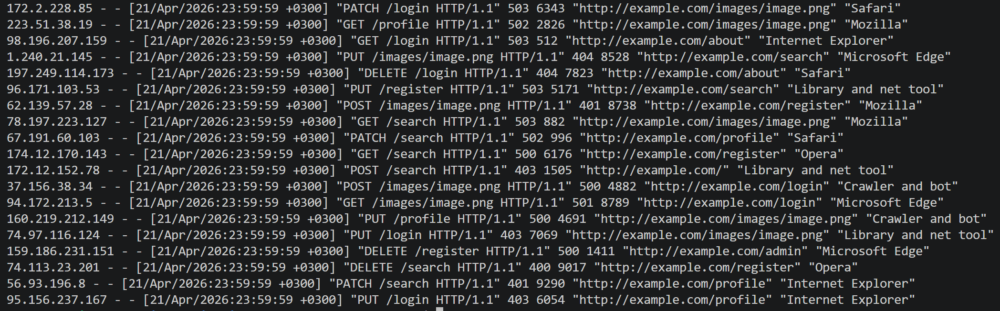
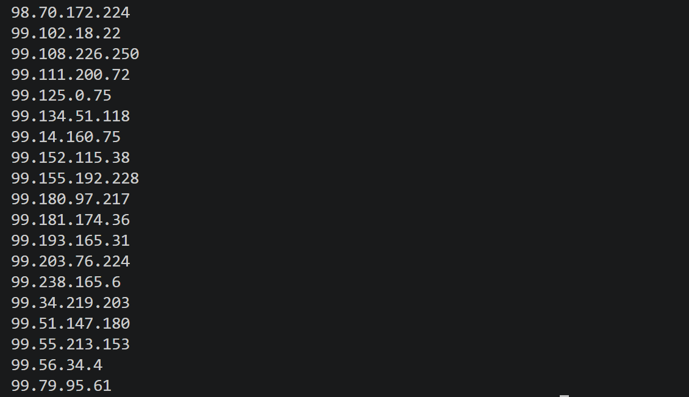

# Задание 05 - Мониторинг

## Задание

Напиши bash-скрипт для разбора логов nginx из Части 4 через awk.

Скрипт запускается с 1 параметром, который принимает значение 1, 2, 3 или 4. В зависимости от значения параметра выведи:

1. Все записи, отсортированные по коду ответа;
2. Все уникальные IP, встречающиеся в записях;
3. Все запросы с ошибками (код ответа — 4хх или 5хх);
4. Все уникальные IP, которые встречаются среди ошибочных запросов.

## Использование

Вывод для 1:

Вывод для 2:

Вывод для 3:

Вывод для 4:

