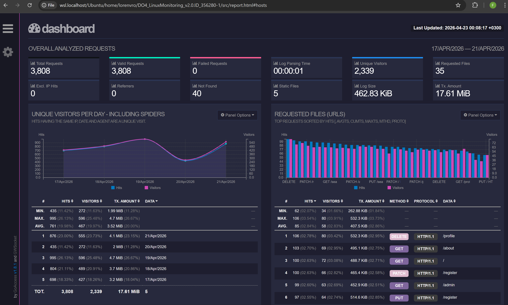

# Задание 6 - GoAccess

## Задание
С помощью утилиты GoAccess получи ту же информацию, что и в Части 5.

Открой веб-интерфейс утилиты на локальной машине.

## Выполнение

```
sudo apt install goaccess
goaccess 04/nginx_*.log -o report.html --log-format=COMBINED
```

Веб-интерфейс утилиты:

