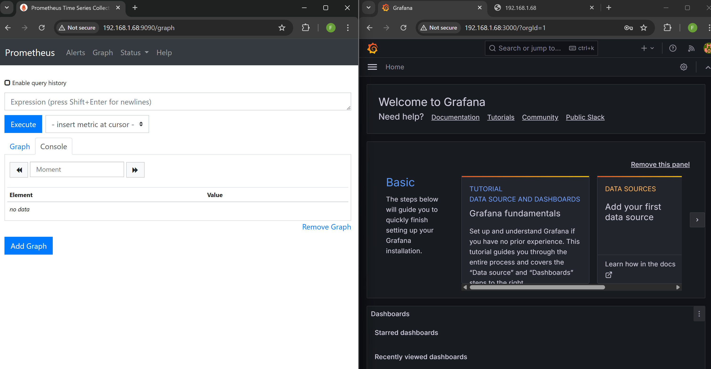
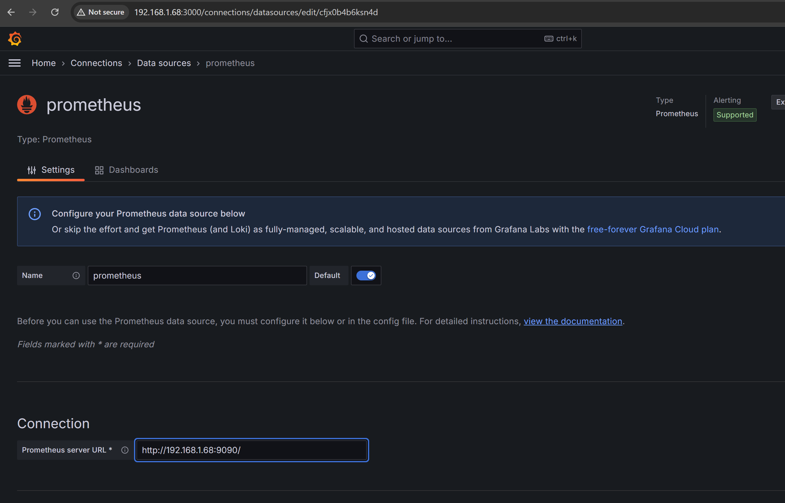
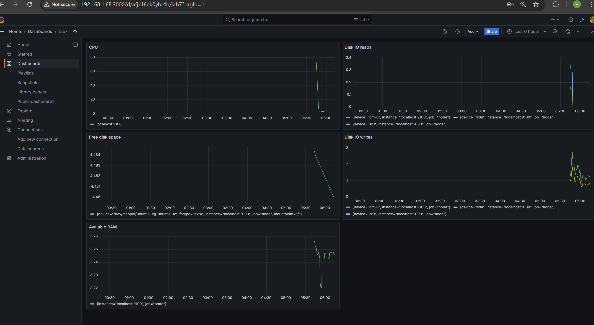
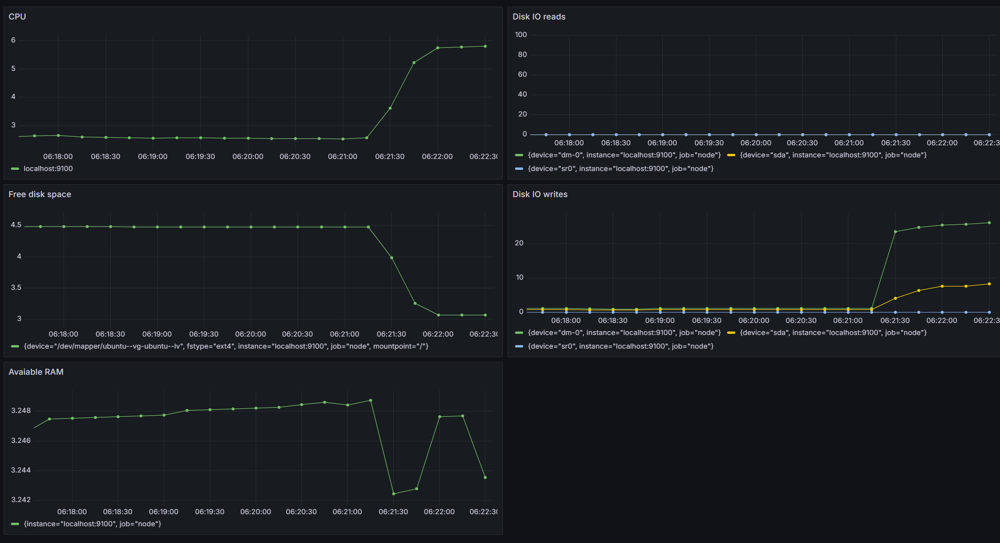
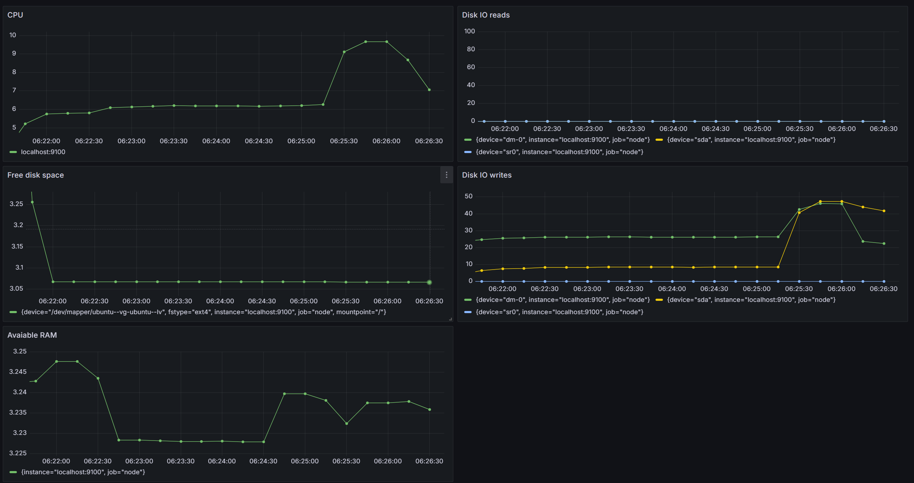

# Задание 7 - Prometheus и Grafana

## Задание
Установи и настрой Prometheus и Grafana на виртуальную машину.\
Получи доступ к веб-интерфейсам Prometheus и Grafana с локальной машины.\
Добавь на дашборд Grafana отображение ЦПУ, доступной оперативной памяти, свободное место и кол-во операций ввода/вывода на жестком диске.\
Запусти свой bash-скрипт из Части 2.\
Посмотри на нагрузку жесткого диска (место на диске и операции чтения/записи).\
Установи утилиту stress и запусти команду ```stress -c 2 -i 1 -m 1 --vm-bytes 32M -t 10s```\
Посмотри на нагрузку жесткого диска, оперативной памяти и ЦПУ.

## Выполнение

```
# установка Prometheus, nod-exporter
sudo apt install prometheus prometheus-node-exporter
sudo systemctl enable prometheus
sudo systemctl start prometheus

# установка Grafana
sudo apt install libfontconfig1 musl
wget https://dl.grafana.com/oss/release/grafana_11.1.0_amd64.deb
sudo dpkg -i grafana_11.1.0_amd64.deb
sudo systemctl enable grafana-server
sudo systemctl start grafana-server

# установка stress
sudo apt install stress
```

### Получение доступа к веб-интерфейсам

Веб-интерфейсы grafana, prometheus:



Добавление 



Добавляем панели мониторинга для отображения следующих метрик:

- CPU
- Available RAM
- Free disk space
- Disk IO reads/writes

Dashboard grafana:



Dashboard grafana после запуска скрипта из 2 части:



Запускаем команду ```stress -c 2 -i 1 -m 1 --vm-bytes 32M -t 10s```

Dashboard после запуска stress:

