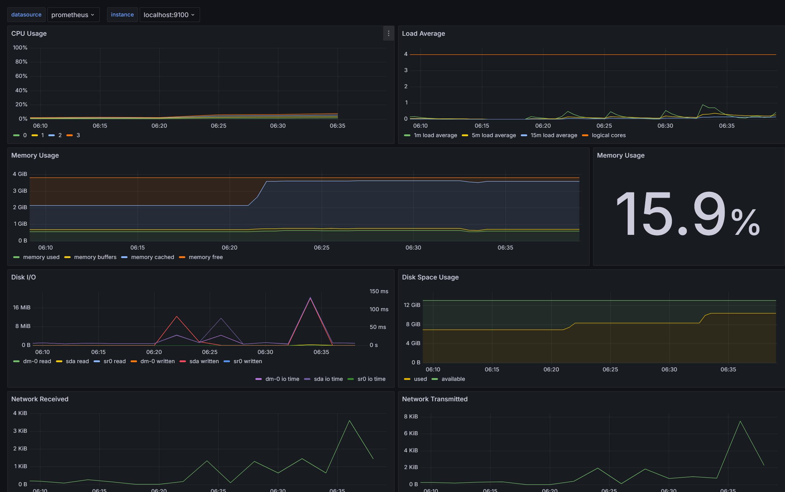
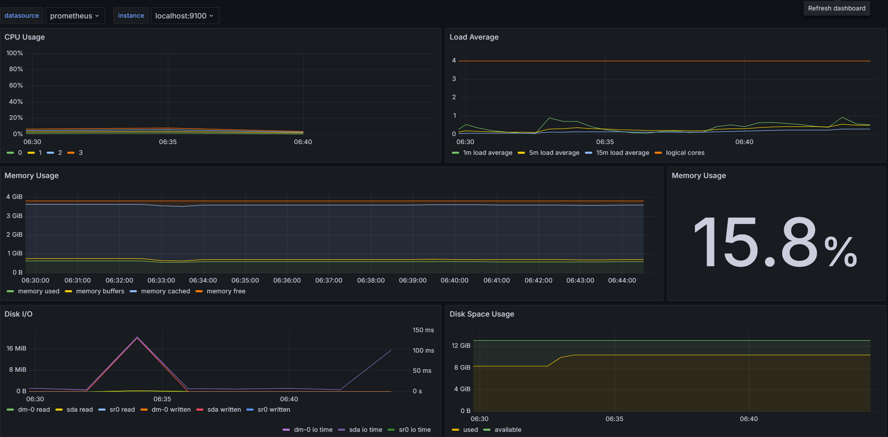
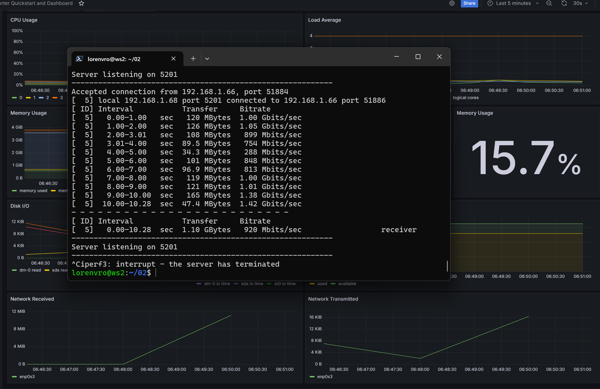

# Задание 8 - Готовый дашборд

## Задание
Установи готовый дашборд Node Exporter Quickstart and Dashboard с официального сайта Grafana Labs.\
Проведи те же тесты, что и в Части 7.\
Запусти ещё одну виртуальную машину, находящуюся в одной сети с текущей.\
Запусти тест нагрузки сети с помощью утилиты iperf3\
Посмотри на нагрузку сетевого интерфейса.

## Выполнение
Установка готового дашборда:
Dashboards -> Import -> ID: 13978

Dashboard после запуска скрипта из задания 2:

Dashboard после запуска stress:

Dashboard после теста нагрузки сети с помощью утилиты iperf3.

