## Part 1. Инструмент ipcalc
### 1.1. Сети и маски
Установка ipcalc
```
sudo apt update
sudo apt install ipcalc
```

1. Адрес сети 192.167.38.54/13:

    Вывод команды ipcalc:

    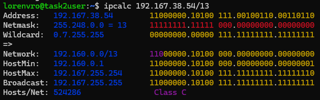

    Адрес сети - 192.160.0.0/13 

2. Перевод маски 255.255.255.0 в префиксную и двоичную запись, /15 в обычную и двоичную, 11111111.11111111.11111111.11110000 в обычную и префиксную

    Перевод маски 255.255.255.0
    - префиксная запись: /25
    - двоичная запись: 11111111.11111111.11111111. 00000000
    
    Перевод маски /15:
    - обычная запись: 255.254.0.0 
    - двоичная запись:  11111111.11111110.00000000. 00000000

    Перевод маски 11111111.11111111.11111111.11110000: (ipcalc не поддерживает двоичную запись на вход)
    - обычная запись: 255.255.255.240
    - префиксная запись:  /28

    Выполнение команд для перевода.

    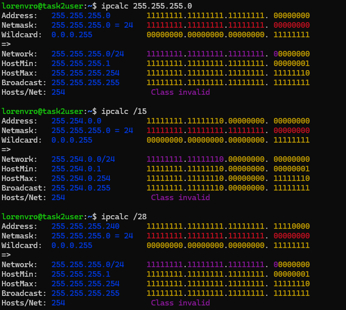

3. Минимальный и максимальный хост в сети 12.167.38.4 при масках: /8, 11111111.11111111.00000000.00000000, 255.255.254.0 и /4

    При маске /8:
    - минимальный хост: 12.0.0.1 
    - максимальный хост: 12.255.255.254  

    При маске 11111111.11111111.00000000.00000000(255.255.0.0)
    - минимальный хост: 12.167.0.1
    - максимальный хост: 12.167.255.254

    При маске 255.255.254.0:
    - минимальный хост: 12.167.38.1
    - максимальный хост: 12.167.39.254

    При маске /4:
    - минимальный хост: 0.0.0.1
    - максимальный хост: 15.255.255.254

    Вывод ipcalc:

    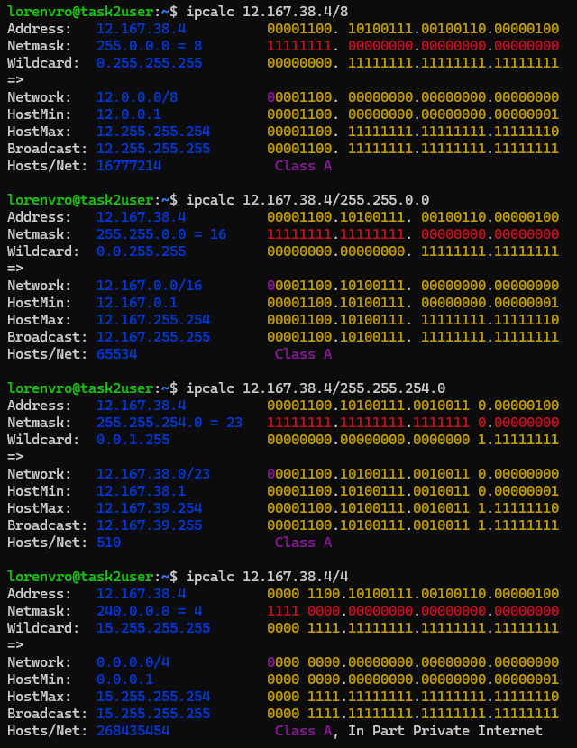

### 1.2 localhost

    Можно ли обратиться к приложению на localhost со следующих IP:
    - 194.34.23.100: нельзя, не входит в диапазон 127.0.0.0/8
    - 127.0.0.2: можно, входит в диапазон 127.0.0.0/8
    - 127.1.0.1: можно, входит в диапазон 127.0.0.0/8
    - 128.0.0.1: нельзя, не входит в диапазон 127.0.0.0/8

    Вывод ipcalc:

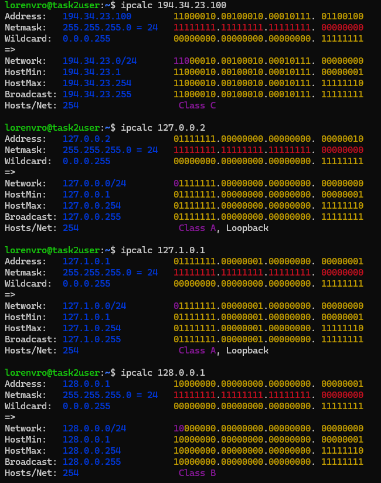

### 1.3. Диапазоны и сегменты сетей
    1. Публичные и частные адреса

    Частные диапазоны (RFC 1918):

    - 10.0.0.0/8 (10.0.0.0 — 10.255.255.255)
    - 172.16.0.0/12 (172.16.0.0 — 172.31.255.255)
    - 192.168.0.0/16 (192.168.0.0 — 192.168.255.255)

    Частные: 
    - 10.0.0.45 (диапазон 10.0.0.0/8)
    - 192.168.4.2 (диапазон 192.168.0.0/16)
    - 172.20.250.4 (диапазон 172.16.0.0/12)
    - 172.16.255.255 (диапазон 172.16.0.0/12)
    - 10.10.10.10 (диапазон 10.0.0.0/8)

    Публичные:
    - 134.43.0.2
    - 172.0.2.1 (не входит в 172.16.0.0/12)
    - 192.172.0.1 (не входит в 192.168.0.0/16)
    - 172.68.0.2 (не входит в 172.16.0.0/12)
    - 192.169.168.1 (не входит в 192.168.0.0/16).

    Вывод ipcalc:

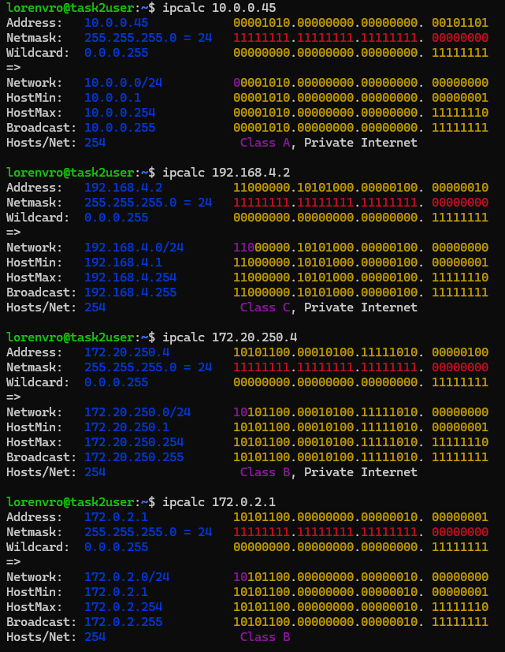

    2. Возможные IP-адреса шлюза для сети 10.10.0.0/18:

    Сеть 10.10.0.0/18 охватывает диапазон: 10.10.0.0 — 10.10.63.255

    Возможные (входят в диапазон сети):
    - 10.10.0.2
    - 10.10.10.10
    - 10.10.1.255

    Невозможные (не входят в диапазон сети):
    - 10.0.0.1
    - 10.10.100.1

    Вывод ipcalc:
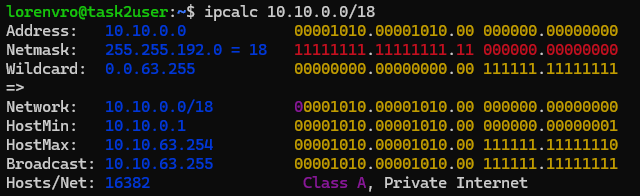

## Part 2. Статическая маршрутизация между двумя машинами

Вывод команды ``` ip a ``` на ws1 и ws2:

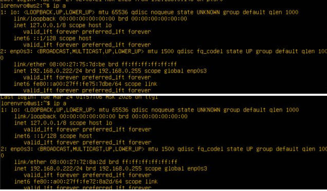

Новые статические адреса в netplan для ws1 и ws2:

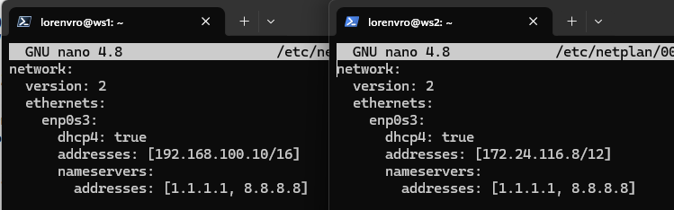

Перезапуск сервиса:
```
sudo netplan apply
sudo netplan try

# проверка
ip a
```

Вывод ```ip a``` после применения  ```netplan apply```: 
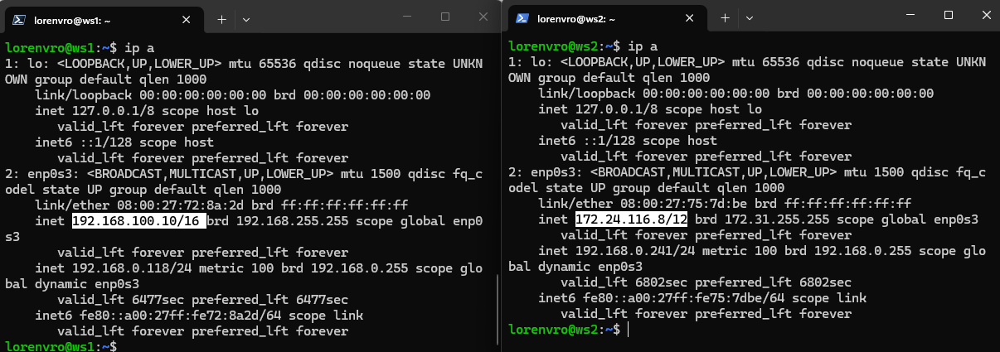

### 2.1. Добавление статического маршрута вручную

```
# На ws1
sudo ip r add 172.16.0.0/12 dev enp0s3
# На ws2
sudo ip r add 192.168.0.0/16 dev enp0s3
# На ws1
ping -c 4 172.24.116.8
# На ws2
ping -c 4 192.168.100.10
```
Вывод команды ping на после выполнения команды ip r add на ws1, ws2:
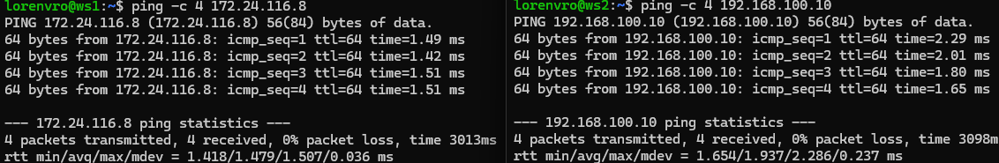

### 2.2 Добавление статического маршрута с сохранением

Перезапуск машина ``` sudo reboot ```

Добавление маршрутов в netplan:
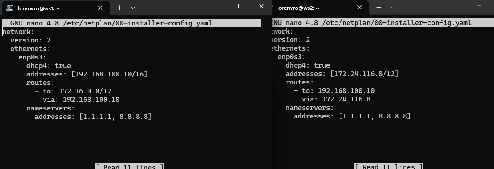

Проверка ```ping``` 
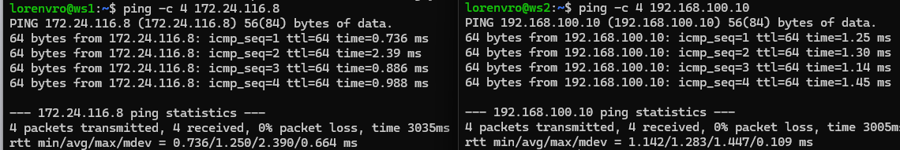

## Part 3. Утилита iperf3
Установка iperf
```
sudo apt update
sudo apt install iperf3
```

### 3.1. Скорость соединения
Переводы едениц измерения:
- 8 Mbps = 1 MB/s
- 100 MB/s = 819200 Kbps 
- 1 Gbps = 1000 Mbps

### 3.2. Утилита iperf3
``` 
# На ws1 
iperf3 -s

# На ws2 
iperf3 -c 192.168.100.10
```
Вызов и вывод iperf3
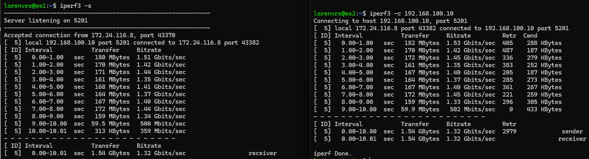


## Part 4. Сетевой экран
Создание firewall скрипта:
```
# На ws1 и ws2
sudo nano /etc/firewall.sh
```

Содержимое скрипта firewall.sh на ws1, ws2:
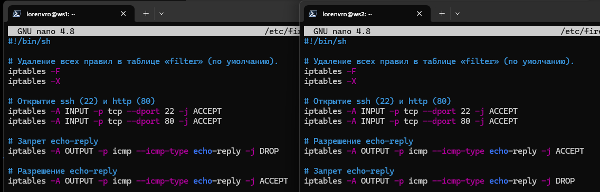

Запуск и проверка:
```
# Запуск файлов на ws1 ws2
sudo chmod +x /etc/firewall.sh
sudo /etc/firewall.sh
```
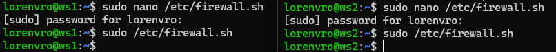

Разница стратегий:
- ws1 (deny-first): Сначала DROP echo-reply (п.4), потом ACCEPT (п.5) — финал ACCEPT (пингуется), так как правила проверяются сверху вниз.
- ws2 (allow-first): Сначала ACCEPT (п.5), потом DROP (п.4) — финал DROP (не пингуется).

Разница в порядке: iptables применяет первое совпадение.

## 4.2. Утилита nmap
Установка nmap 
```
sudo apt install nmap
```


Вывод ping и nmap на ws1,ws2:
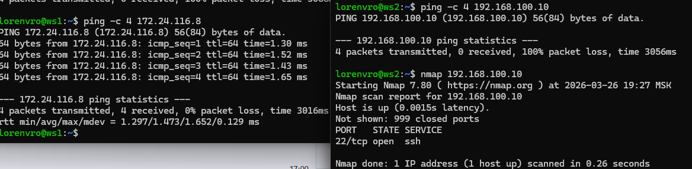

## Part 5. Статическая маршрутизация сети
Поднято 5 виртуальных машин r1,r2,ws11,ws21,ws22.
Настроены сетевые адаптеры (Внутренняя сеть), а именно:
- r1: intnet1, intnet2
- r2: intnet2, intnet3
- ws11: intnet1
- ws21: intnet3
- ws22: intnet3

### 5.1. Настройка адресов машин
```
# на всех ВМ
sudo nano /etc/netplan/00-installer-config.yaml
sudo netplan apply
```
Конфигурация netplan на 5 ВМ:
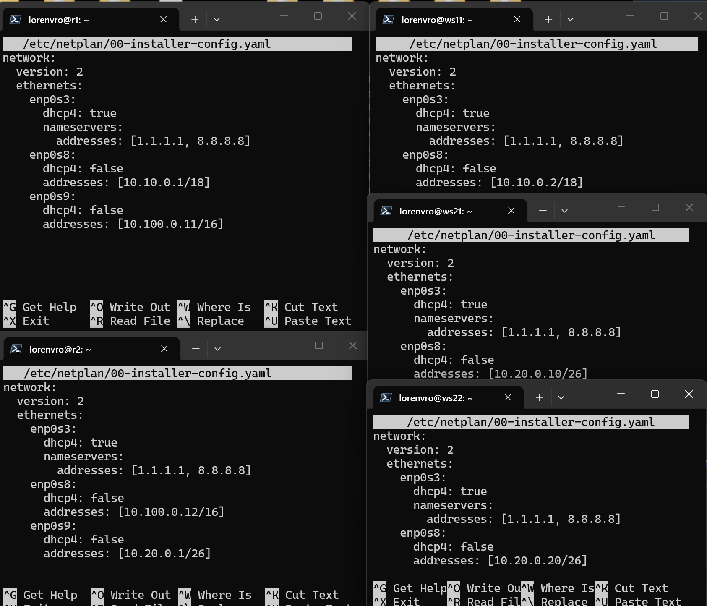

Проверка ```ip -4 a```
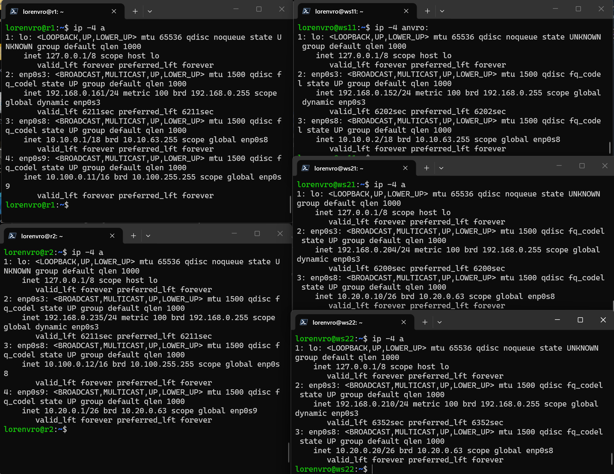

Проверка ping между ws21-ws22 и ws11-r1
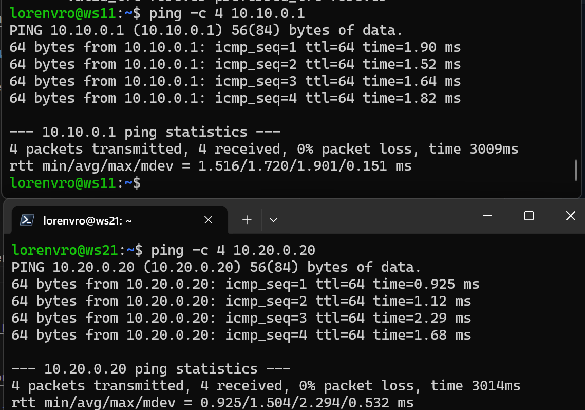

### 5.2. Включение переадресации IP-адресов

Вывод ```sysctl -w net.ipv4.ip_forward=1``` на r1, r2:
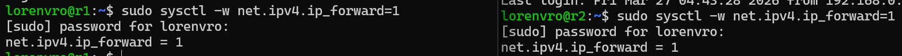

Изменение sysctl:
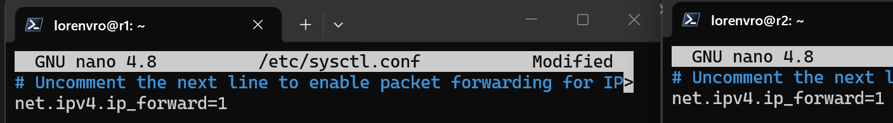

### 5.3. Установка маршрута по умолчанию
Добавляем маршрут по умолчанию на ws11, ws21, ws22:
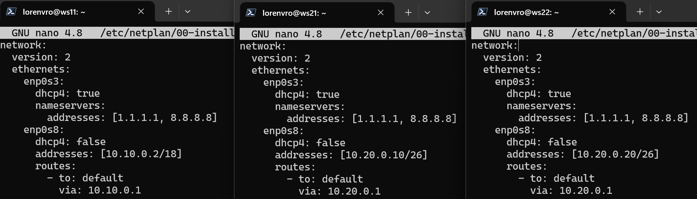

```
sudo netplan apply
ip r | grep enp0s8
```
Вывод ```ip r``` на рабочих станциях:
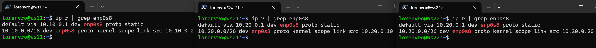

```
# На r2
sudo tcpdump -tn -i enp0s8
# На ws11
ping -c 4 10.100.0.12
```
Вывод ping с ws11 до r2 и перехват пакетов на r2:
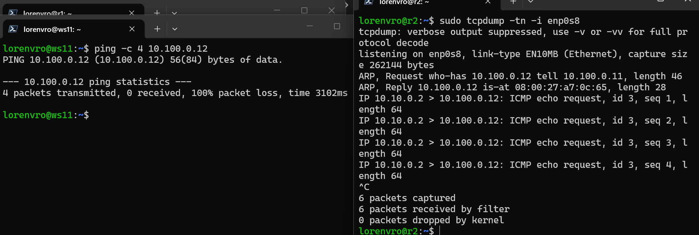


### 5.4. Добавление статических маршрутов
Добавляем статические маршруты на r1, r2:
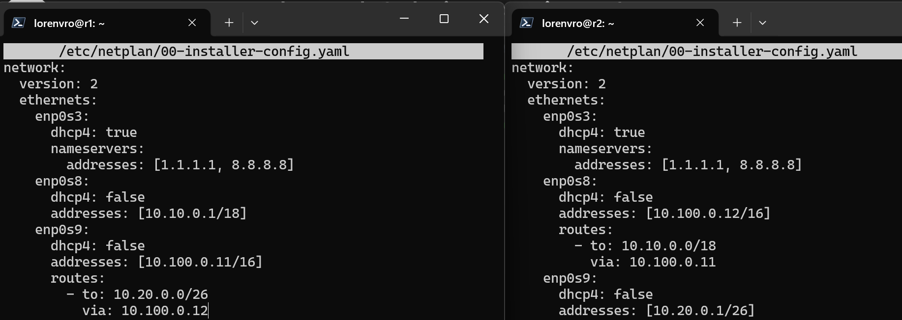

``` 
# На r1, r2
sudo netplan apply
ip r
```
Вывод ```ip r``` на роутерах:

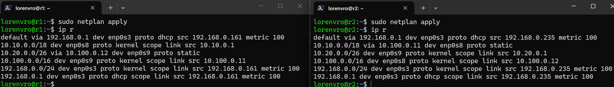

```
# На ws11
ip r list 10.10.0.0/18
ip r list 0.0.0.0/0
```
Вывод ```ip r list``` на ws11:

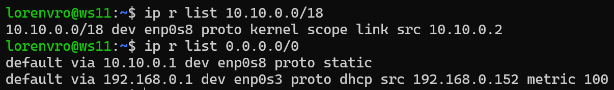

Для сети 10.10.0.0/18 был выбран маршрут 10.10.0.0/18 dev enp0s8, а не маршрут по умолчанию 0.0.0.0/0, поскольку в таблице маршрутизации Linux используется правило наибольшего совпадения префикса. Маршрут /18 является более специфичным, чем /0, поэтому он имеет приоритет. Маршрут по умолчанию используется только тогда, когда более точного маршрута для адреса назначения нет.
В Linux действует принцип longest prefix match (совпадение самого длинного префикса).

### 5.5. Построение списка маршрутизаторов
```
# На r1
sudo tcpdump -tnv -i enp0s8

# На ws11
sudo apt install traceroute
traceroute 10.20.0.10
```
Вывод traceroute и tcpdump:
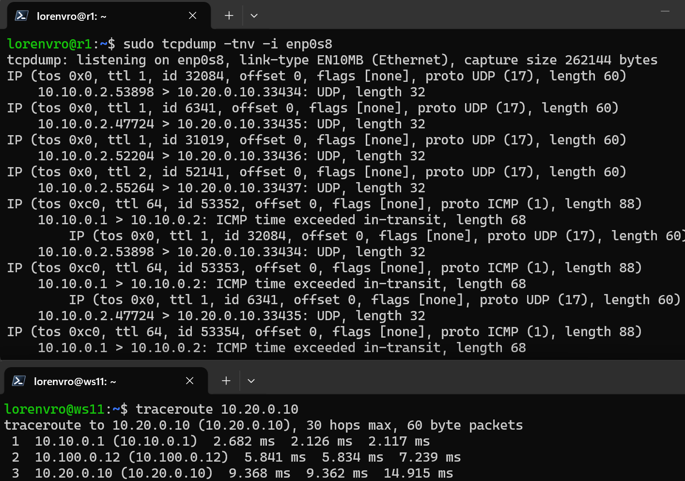

***Принцип работы traceroute:***

Утилита traceroute определяет путь до узла назначения, отправляя пакеты с постепенно увеличивающимся значением TTL. Каждый маршрутизатор по пути уменьшает TTL на 1; когда TTL становится равным 0, маршрутизатор отбрасывает пакет и отправляет источнику ICMP Time Exceeded. По адресам этих ICMP-ответов traceroute последовательно определяет список маршрутизаторов на пути от ws11 до ws21. Дамп tcpdump на r1 подтверждает прохождение таких пакетов и показывает ответы, возникающие при истечении TTL.

### 5.6. Использование протокола ICMP при маршрутизации
```
# На r1
sudo tcpdump -n -i enp0s8 icmp

# На ws11
ping -c 1 10.30.0.111
```
Перехват ICMP-трафика на r1 и ping несуществующего адреса с ws11:
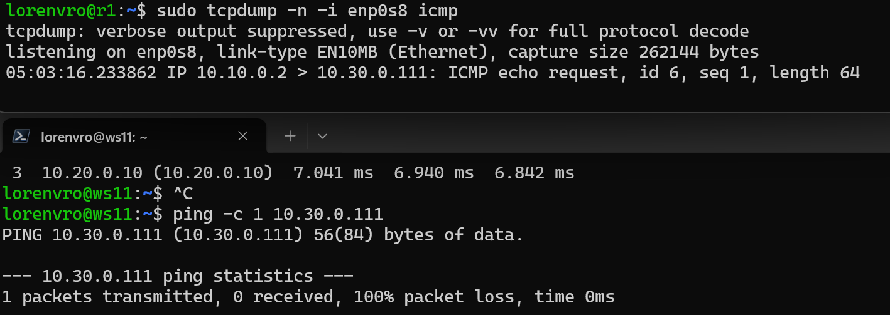

## Part 6. Динамическая настройка IP с помощью DHCP
Содержимое файла /etc/dhcp/dhcpd.conf на r2:

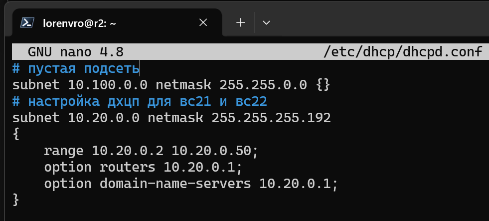

```
# Настройка DNS
sudo nano /etc/resolv.conf
# добавить nameserver 8.8.8.8 
```
Содержимое файла /etc/resolv.conf на r2:

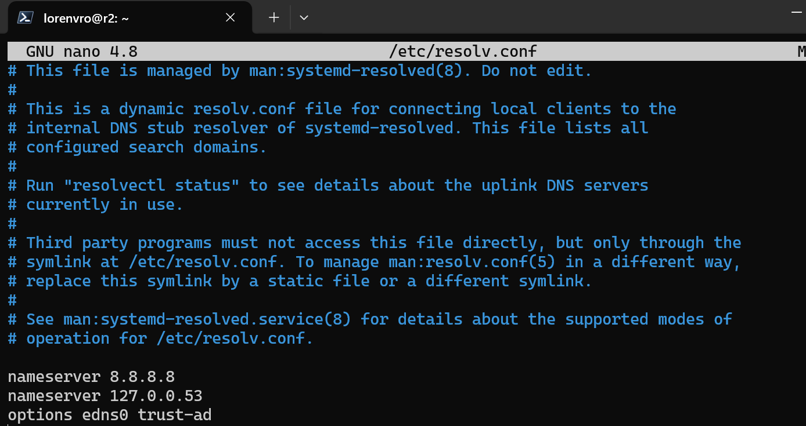

```
# установка службы DHCP
sudo apt install isc-dhcp-server
# Указать интерфейс для DHCP
sudo nano /etc/default/isc-dhcp-server
# изменить строчку на 
INTERFACESv4="enp0s9"
# перезагрузка службы DHCP
sudo systemctl restart isc-dhcp-server
```
Проверка работы DHCP на ws21:

```
# Изменить строки в netplan:
sudo nano /etc/netplan/00-installer-config.yaml
   # enp0s8:
   #   dhcp4: true
   # убрать строчку addresses
sudo netplan apply
sudo reboot
```

Вызов ```ip a``` и ```ping``` на ws21:

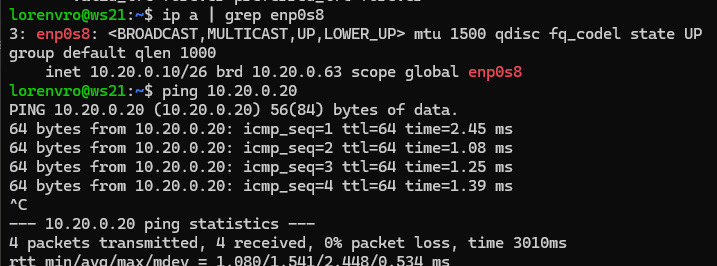

### MAC-адрес у ws11
```
# На ws11
sudo nano /etc/netplan/00-installer-config.yaml
sudo netplan apply
```
Измененный netplan config на ws11:

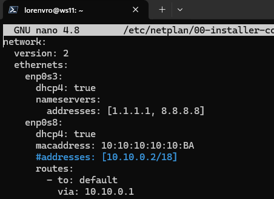

### Настройка DHCP на r1
```
sudo nano /etc/resolv.conf
# добавить nameserver 8.8.8.8
```
Изменить макадрес на интерфейсе виртуальной машины на 1010101010BA
```
# Указать интерфейс для DHCP
sudo nano /etc/default/isc-dhcp-server
# INTERFACESv4="enp0s8"
```
Измененный ```/etc/dhcp/dhcpd.conf ``` на r1:


```
# Перезапуск службы
sudo systemctl restart isc-dhcp-server
```
Вызов ```ip a``` и ```ping``` на ws11:

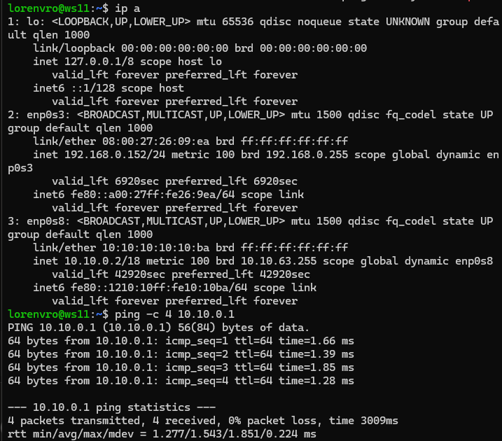

### Обновление IP на ws21
```
ip a show enp0s8 #вывод ip интерфейса
sudo dhclient -r enp0s8 #освобождение текущего адреса
sudo dhclient -v enp0s8 #запрос нового адреса
```
Обновление IP на ws21 на ws21:
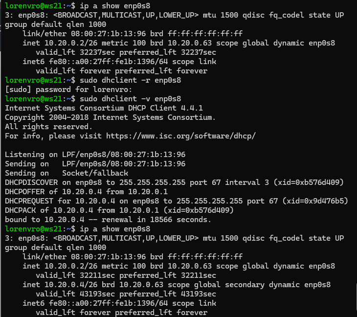
### Опции DHCP-сервера, использованные в задании:
1. subnet — подсеть, для которой будет работать DHCP
2. netmask — маска подсети
3. range — диапазон IP-адресов для выдачи
4. option routers — адрес шлюза по умолчанию, который будет передан клиентам
5. option domain-name-servers — адрес DNS-сервера для клиентов
6. host — блок конфигурации для конкретного хоста с фиксированными параметрами
7. hardware ethernet — MAC-адрес сетевой карты хоста
8. fixed-address — фиксированный IP-адрес, который будет выдан хосту с указанным MAC-адресом

## Part 7. NAT
```
#Установка apache ws22, r1
sudo apt install apache2
```

### Настройка Apache
```
# ws22 & r1
sudo nano /etc/apache2/ports.conf
# заменить Listen 80 на Listen 0.0.0.0:80
```
Измененный ports.conf на ws22, r1:

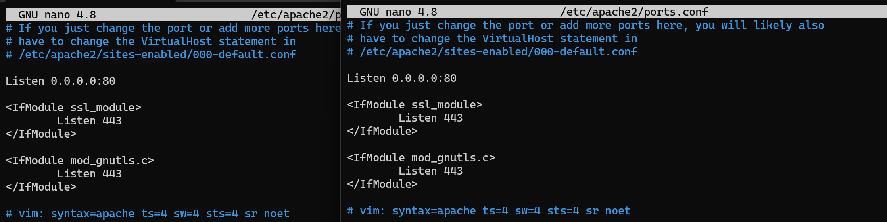

Запуск apache на ws22, r1:

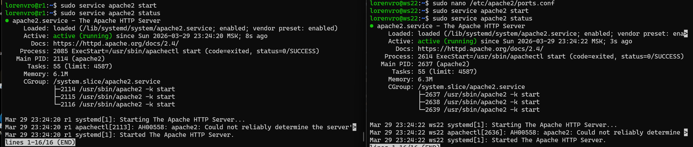
```
# На r2
sudo nano /etc/firewall.sh
# Запуск
sudo chmod +x /etc/firewall.sh
sudo /etc/firewall.sh
```
```
#Содержимое /etc/firewall.sh
# 1. Удаление правил в таблице filter
iptables -F

# 2. Удаление правил в таблице NAT
iptables -F -t nat

# 3. Отбрасывать все маршрутизируемые пакеты
iptables --policy FORWARD DROP
```

Проверь соединение между ws22 и r1 командой ping.
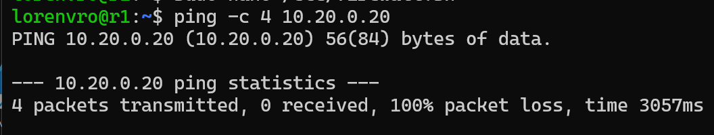

### Разрешение ICMP
Добавление нового правила ``` /etc/firewall.sh``` на r2
```
# 4. Разрешить маршрутизацию пакетов ICMP
iptables -A FORWARD -p icmp -j ACCEPT
```
Проверка связи между ws22 и r1

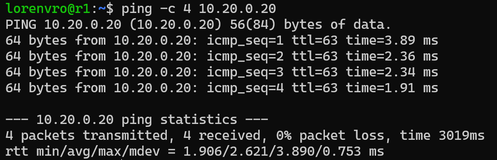
### SNAT, DNAT
```
# 5. SNAT
iptables -t nat -A POSTROUTING -o enp0s8 -s 10.20.0.0/26 -j MASQUERADE

# Разрешить обратный трафик для уже установленных и связанных соединений
iptables -A FORWARD -m state --state RELATED,ESTABLISHED -j ACCEPT

# маршрутизация исходящего трафика из внутренней сети 10.20.0.0/26
iptables -A FORWARD -s 10.20.0.0/26 -j ACCEPT

# 6. DNAT :8080 на Apache ws22:80
iptables -t nat -A PREROUTING -i enp0s8 -p tcp --dport 8080 -j DNAT --to-destination 10.20.0.20:80

# маршрутизация для перенаправленного трафика
iptables -A FORWARD -p tcp -d 10.20.0.20 --dport 80 -j ACCEPT
```
Полное содержимое файла ``` /etc/firewall.sh``` на r2

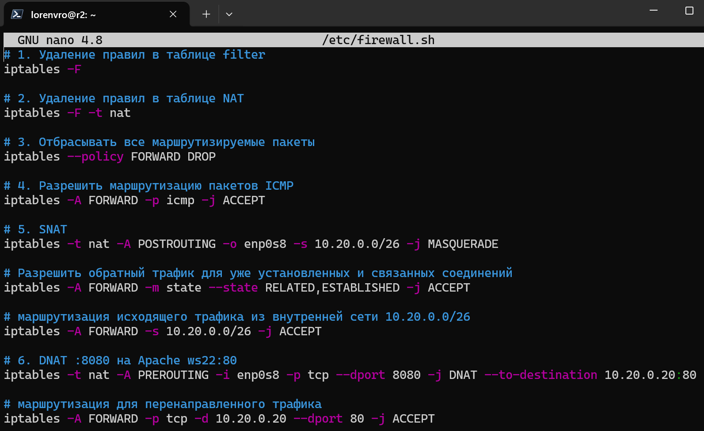


### Проверка SNAT и DNAT

Проверка подключения telnet:

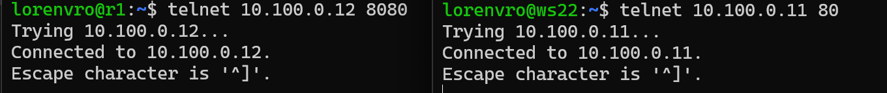
## Part 8. Дополнительно. Знакомство с SSH Tunnels