# Simple Docker

## Part 1. Готовый докер

Загрузка официального образа nginx командой `docker pull nginx`:
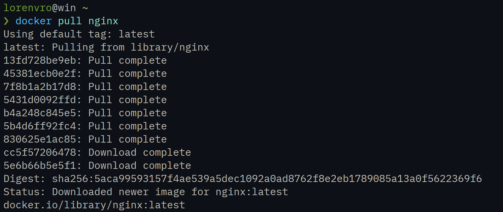

Проверка наличия образа командой `docker images`:


Запуск docker образа через `docker run -d nginx`:


Проверка запуска контейнера через `docker ps`:
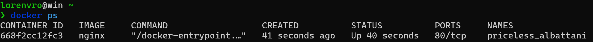

Просмотр информации о контейнере через `docker inspect [container_id]`:


Размер контейнера:
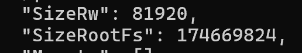

Список замапленных портов:
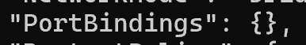

IP контейнера:
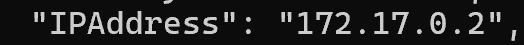

Остановка контейнера через `docker stop [container_id]`:
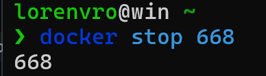

Проверка остановки контейнера через `docker ps`:
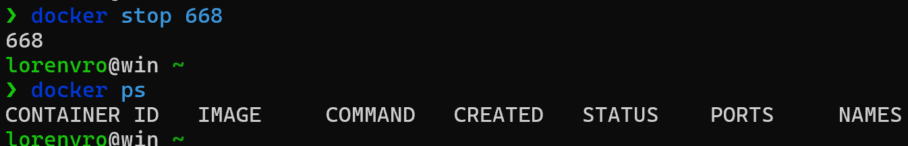

Запуск docker с маппингом портов 80 и 443 через `docker run -d -p 80:80 -p 443:443 nginx`:
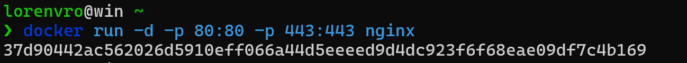

Проверка доступности страницы nginx по адресу localhost:80:
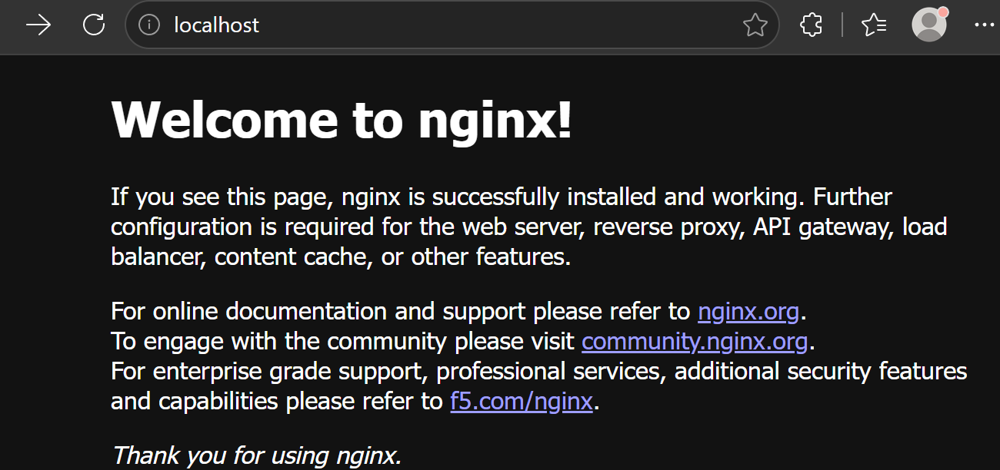

Перезапуск контейнера через `docker restart [container_id]`:


Проверка работы контейнера через `docker ps`:


## Part 2. Операции с контейнером

Чтение конфигурационного файла nginx.conf внутри контейнера через `docker exec [container_id] cat /etc/nginx/nginx.conf`:
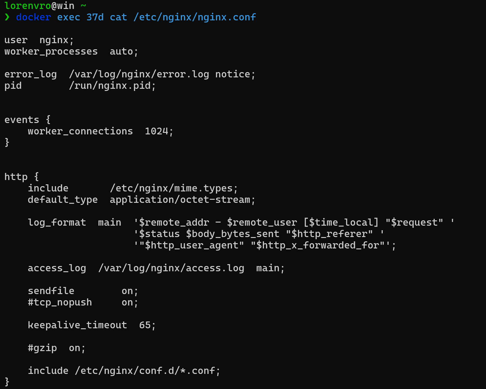

Блок `server` находится по пути /etc/nginx/conf.d/default.conf

```bash
# Копируем на локальную машину default.conf > nginx.conf
docker exec [container_id] cat /etc/nginx/conf.d/default.conf > nginx.conf

# Добавляем отдачу статуса сервера по пути /status 
location /status {
    stub_status on;
}
```

Содержимое локального файла nginx.conf с настройкой отдачи /status:
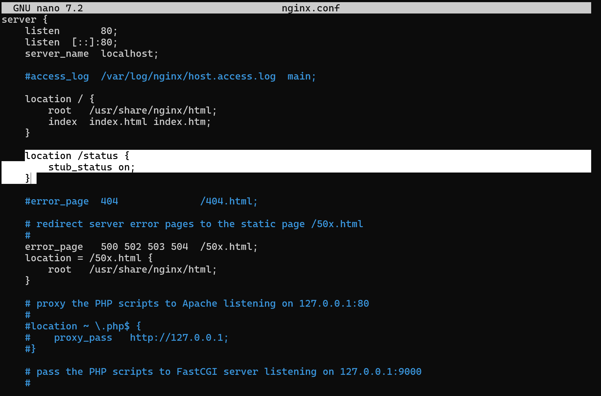

```bash
# Копируем отредактированный конфиг в конфиг контейнера
docker cp nginx.conf [container_id]:/etc/nginx/conf.d/default.conf

# Перезапускаем nginx
docker exec [container_id] nginx -s reload
```


Проверка доступности страницы статуса по адресу localhost:80/status:


Экспорт контейнера в файл container.tar через `docker export [container_id] > container.tar`:
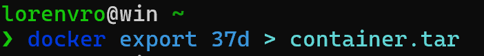

Остановка контейнера через `docker stop [container_id]`:


Удаление образа через `docker rmi nginx`:

Удаление контейнера через `docker rm [container_id]`:


Импорт контейнера через `docker import container.tar nginx:imported`:
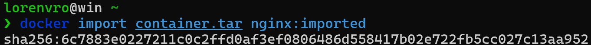

Запуск импортированного контейнера через `docker run -d -p 80:80 nginx:imported nginx -g "daemon off;"`:
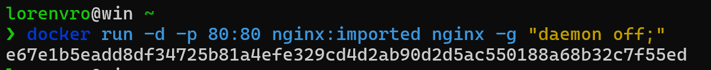

Проверка доступности страницы статуса по адресу localhost:80/status:
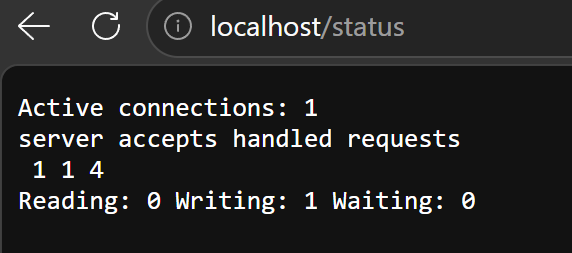


## Part 3. Мини веб-сервер
  
Мини-сервер на C и FastCgi [server.c](./img/./server.c), возвращающий страничку "Hello, World!"
  
```bash
# Устанавливаем библиотеки fcgi
sudo apt-get install libfcgi-dev spawn-fcgi

# Компилируем сервер
gcc -Wall -Werror -Wextra server.c -lfcgi -o hello
```

Запускаем сервер `spawn-fcgi -p 8080 ./hello`
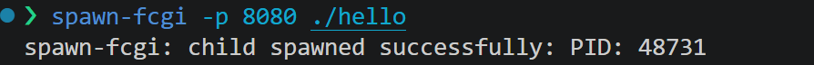

Создаём файл [nginx.conf](./img/./nginx/nginx.conf) для проксирования запросов с порта 81 на 127.0.0.1:8080:
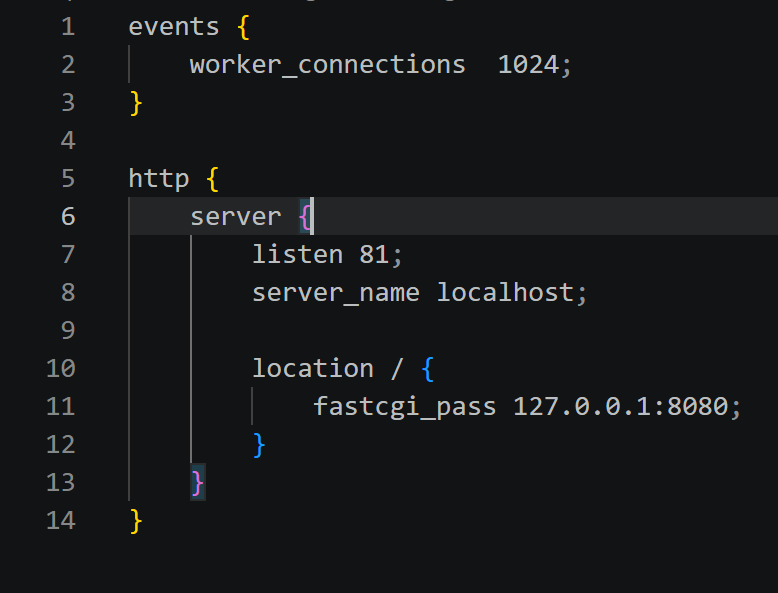

Запускаем nginx с созданной конфигурацией `sudo nginx -c nginx/nginx.conf`

Проверяем доступность страницы по адресу localhost:81

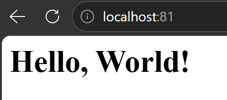


## Part 4. Свой докер

Напишем [Dockerfile](./img/./Dockerfile) для сборки и запуска мини-сервера с nginx

Собираем образ через `docker build -t hello:1.0 .`

Проверяем созданный образ через `docker images`

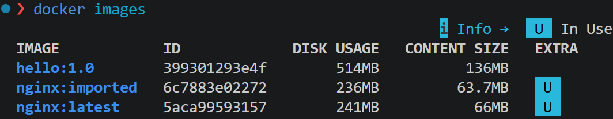

Запускаем образ с маппингом портов и папки nginx `docker run -d -p 8080:81 -v $(pwd)/nginx:/etc/nginx hello:1.0`

Проверяем доступность страницы по адресу localhost:80:


Добавляем настройку /status в [nginx.conf](./img/./nginx/nginx.conf)

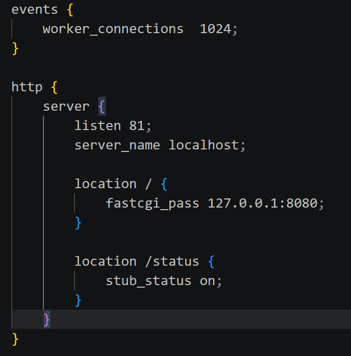

Перезапускаем контейнер `docker restart [container_id]`, проверяем доступность страницы статуса по адресу localhost:80/status:

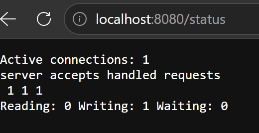


## Part 5. Инструмент Dockle

- Устанавливаем dockle
  
```bash
# Скачиваем .deb пакет и устанавливаем
wget https://github.com/goodwithtech/dockle/releases/download/v0.4.15/dockle_0.4.15_Linux-64bit.deb
sudo dpkg -i dockle_0.4.15_Linux-64bit.deb
```

Сканируем образ через `dockle hello:1.0`:
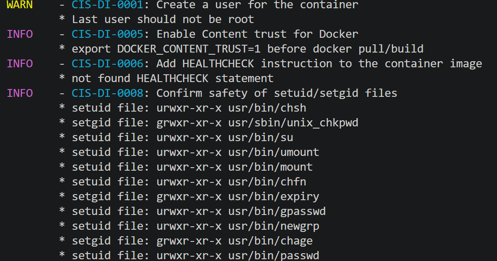

Добавляем пользователя и HEALTHCHECK в [Dockerfile](./img/./Dockerfile) для устранения WARN и INFO HEALTHCHECK

Пересобираем образ: `docker build -t hello_server:2.0 .`

Повторно сканирум через dockle и убеждаемся в отсутствии ошибок:
  
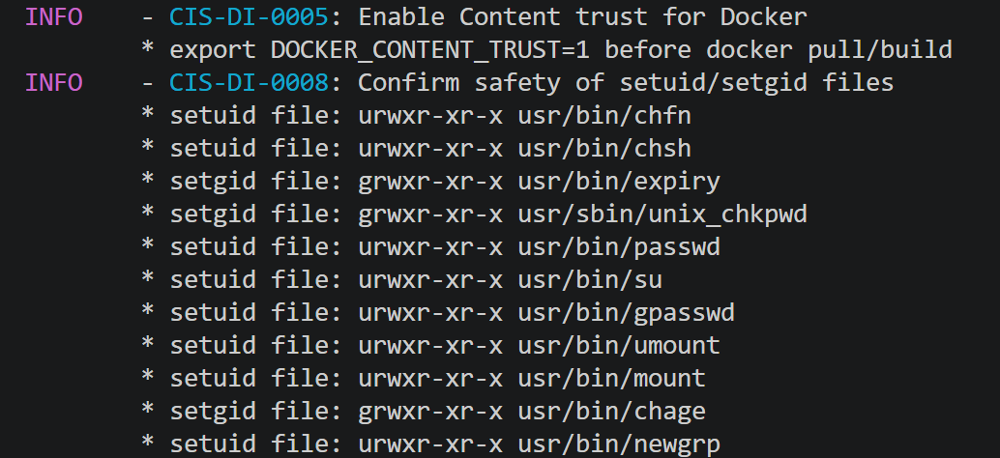


## Part 6. Базовый Docker Compose

Установим docker compose `sudo apt install docker-compose`

Напишем файл [docker-compose.yml](./img/./docker-compose.yml) для запуска двух контейнеров

Создаём файл [proxy.conf](./img/./nginx/proxy.conf) с проксированием с порта 8080 на app:81

Остановим все запущенные контейнеры `docker stop $(docker ps -aq)`

Собираем проект через `docker-compose build`

Запускаем проект через `docker-compose up -d`

Проверяем доступность страницы по адресу localhost:80

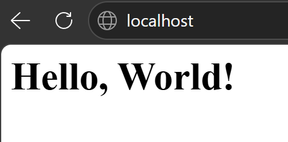