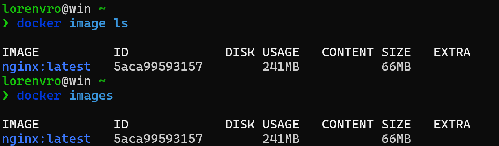
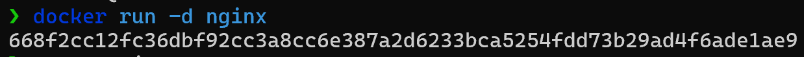
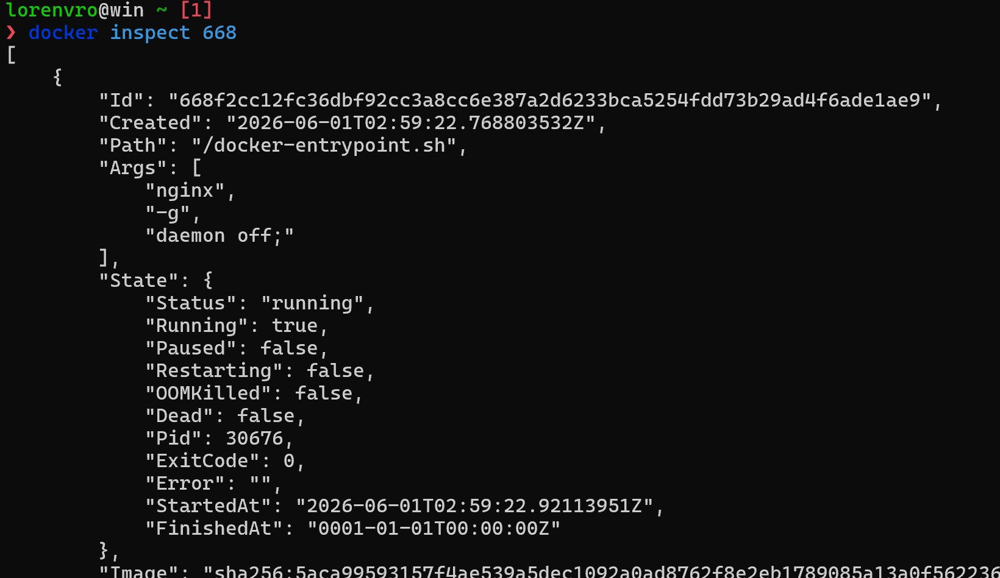
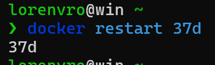
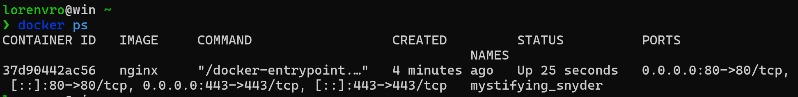
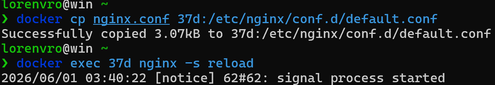
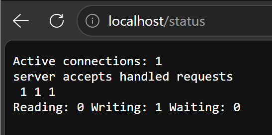
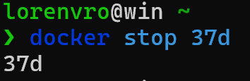
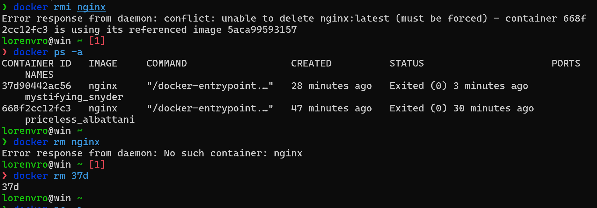

# Simple Docker

## Part 1. Готовый докер

Загрузка официального образа nginx командой `docker pull nginx`:


Проверка наличия образа командой `docker images`:


Запуск docker образа через `docker run -d nginx`:


Проверка запуска контейнера через `docker ps`:


Просмотр информации о контейнере через `docker inspect [container_id]`:


Размер контейнера:


Список замапленных портов:


IP контейнера:


Остановка контейнера через `docker stop [container_id]`:


Проверка остановки контейнера через `docker ps`:


Запуск docker с маппингом портов 80 и 443 через `docker run -d -p 80:80 -p 443:443 nginx`:


Проверка доступности страницы nginx по адресу localhost:80:


Перезапуск контейнера через `docker restart [container_id]`:


Проверка работы контейнера через `docker ps`:


## Part 2. Операции с контейнером

Чтение конфигурационного файла nginx.conf внутри контейнера через `docker exec [container_id] cat /etc/nginx/nginx.conf`:


Блок `server` находится по пути /etc/nginx/conf.d/default.conf

```bash
# Копируем на локальную машину default.conf > nginx.conf
docker exec [container_id] cat /etc/nginx/conf.d/default.conf > nginx.conf

# Добавляем отдачу статуса сервера по пути /status 
location /status {
    stub_status on;
}
```

Содержимое локального файла nginx.conf с настройкой отдачи /status:


```bash
# Копируем отредактированный конфиг в конфиг контейнера
docker cp nginx.conf [container_id]:/etc/nginx/conf.d/default.conf

# Перезапускаем nginx
docker exec [container_id] nginx -s reload
```


Проверка доступности страницы статуса по адресу localhost:80/status:


Экспорт контейнера в файл container.tar через `docker export [container_id] > container.tar`:


Остановка контейнера через `docker stop [container_id]`:


Удаление образа через `docker rmi nginx`:

Удаление контейнера через `docker rm [container_id]`:


Импорт контейнера через `docker import container.tar nginx:imported`:


Запуск импортированного контейнера через `docker run -d -p 80:80 nginx:imported nginx -g "daemon off;"`:


Проверка доступности страницы статуса по адресу localhost:80/status:

